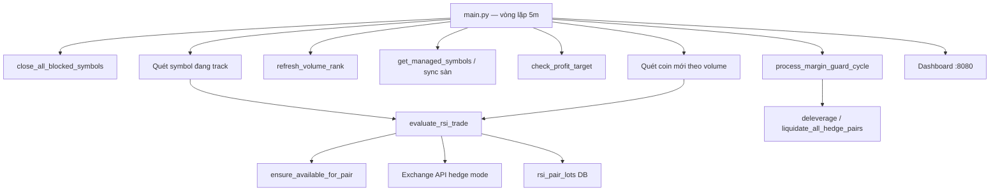
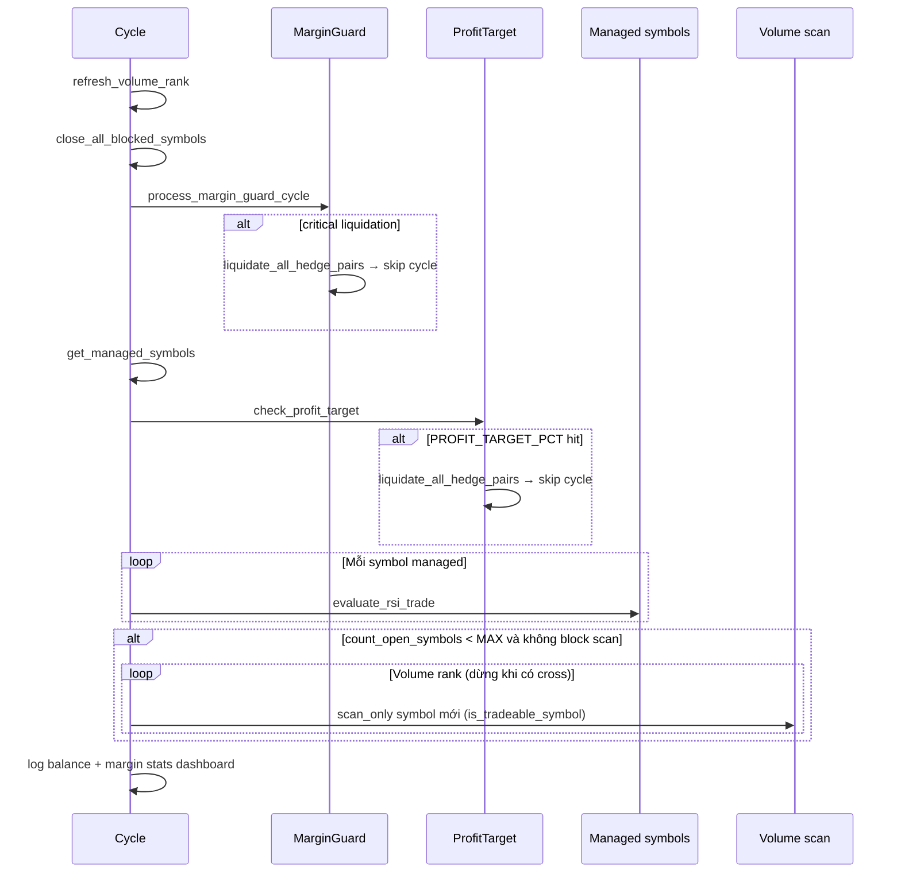

# Tổng hợp logic bot RSI hedged (USDT-M)

Bot chạy vòng **5 phút**, chiến lược **cặp long + short** (hedge mode), tín hiệu **RSI(14)** trên nến **5m**, chốt lãi theo **% giá** (mặc định 2%).

Hỗ trợ **Bitget** hoặc **Binance** USDT-M qua `EXCHANGE=bitget|binance`.

**Path đang chạy:** `python -m src.main` → RSI hedge + dashboard. Các module legacy (EMA/SAR, Supertrend, Ichimoku, OFI trading) vẫn có trong repo nhưng **không** được `main.py` gọi.

---

## 0. Multi-exchange

| Env | Ý nghĩa |
|-----|---------|
| `EXCHANGE=bitget` | Default — Bitget USDT-M |
| `EXCHANGE=binance` | Binance USDT-M mainnet (`fapi.binance.com`) |
| `BITGET_*` | API key Bitget (passphrase bắt buộc) |
| `BINANCE_API_KEY` / `BINANCE_SECRET_KEY` | API key Binance Futures |

**Checklist đổi sàn:**

1. Tắt bot (`TRADING_ENABLED=false` hoặc Ctrl+C)
2. Đổi `EXCHANGE` + credentials tương ứng
3. Dùng `DATABASE_PATH` riêng hoặc `clear_dashboard_history()` — tránh lot lẫn sàn
4. Bật **Hedge Mode** (Dual Side Position) trên app sàn
5. Binance: API key cần quyền **Futures**
6. Restart `python -m src.main`

Code: [`src/exchange/`](src/exchange/) — facade; Bitget adapter bọc [`src/bitget_client.py`](src/bitget_client.py); Binance tại [`src/exchange/binance.py`](src/exchange/binance.py).

---

## 1. Kiến trúc tổng quan



| Thành phần | Vai trò |
|------------|---------|
| `main.py` | Điều phối cycle, scan, margin guard, log balance |
| `rsi_trading.py` | Mở/đóng cặp, chốt lãi, stack, blocked symbol, hedge liquidate |
| `rsi_signals.py` | RSI cross, công thức TP theo % giá |
| `rsi_positions.py` | Sync sàn ↔ DB, danh sách symbol quản lý |
| `margin_guard.py` | Phân tầng maintenance margin, chặn mở mới, deleverage |
| `margin_preflight.py` | Check available trước `_open_pair`, giải phóng margin |
| `order_sizing.py` | Tính margin/size từ equity |
| `exchange/symbols.py` | Filter USDC / symbol không trade được |
| `database.py` | Bảng `rsi_pair_lots` — FIFO từng lần vào cặp |
| `src/exchange/` | Facade Bitget / Binance, hedge orders |
| `profit_target.py` | Chốt toàn portfolio (optional) |
| `web/app.py` | Dashboard lot FIFO, margin guard, PnL calendar |

**Đã bỏ khỏi path RSI:** RSI 1 chiều, DCA, thoát RSI 75/25, manual hold UI.

---

## 2. Khởi động (`python -m src.main`)

1. `init_db()` — tạo/migrate DB (`rsi_pair_lots`, …)
2. `restore_tracked_positions()` — log lot đang mở từ DB
3. `refresh_volume_rank()` — load ranking volume USDT-M (đã lọc USDC)
4. Nếu `TRADING_ENABLED`: `close_all_blocked_symbols()` (startup)
5. Bật **dashboard** FastAPI port `WEB_PORT` (8080)
6. Vòng lặp vô hạn: `run_cycle()` → sleep đến **mốc 5 phút** tiếp theo

**Yêu cầu:** API sàn + **hedge mode**. `TRADING_ENABLED=false` → chỉ sync/dashboard, không đặt lệnh.

---

## 3. Một cycle 5 phút (`run_cycle`)



**Thứ tự chi tiết:**

1. Refresh volume rank (~600+ perpetual, **bỏ USDC**)
2. `close_all_blocked_symbols()` — đóng mọi vị thế symbol blocked (vd. USDCUSDT)
3. `process_margin_guard_cycle()` — đo maint margin, có thể deleverage / đóng hết / chặn scan
4. Nếu `guard.skip_cycle` (critical) → **bỏ qua** phần còn lại của cycle
5. Sync managed symbols
6. `check_profit_target()` — nếu hit → `liquidate_all_hedge_pairs`, skip cycle
7. Với **mỗi symbol managed**: RSI + `evaluate_rsi_trade` (luôn chạy cycle TP)
8. Scan coin mới nếu: `count_open_symbols < MAX_OPEN_SYMBOLS` **và** margin guard **không** `block_new_entries`
9. Log balance (equity, available, maint %, initial %)

**Symbol được track** = có lot open trong DB **hoặc** còn size trên sàn (`sync_exchange_positions`).

---

## 4. Lọc symbol (scan & trade)

[`src/exchange/symbols.py`](src/exchange/symbols.py):

| Rule | Mô tả |
|------|--------|
| `is_scan_symbol` / `is_tradeable_symbol` | Chỉ `*USDT`, loại `*USDC`, `USDCUSDT`, mọi symbol chứa `USDC` |
| Scan volume | Binance + Bitget đều áp dụng filter khi rank |
| `_open_pair` | Từ chối symbol blocked |
| `evaluate_rsi_trade` | Gọi `_force_close_blocked_symbol` nếu symbol blocked còn lot/vị thế |
| `close_all_blocked_symbols` | Startup + đầu mỗi cycle — đóng L+S + sync DB |

---

## 5. Sử dụng vốn (sizing)

Công thức trong `order_sizing.py`:

| Bước | Công thức |
|------|-----------|
| Margin mỗi **leg** | `max(ORDER_MARGIN_MIN_USDT, equity × ORDER_MARGIN_PCT / 100)` |
| Notional | `margin × LEVERAGE` |
| Size coin | `notional / price` (làm tròn theo contract spec sàn) |

**Ví dụ** (`.env` mặc định): equity 200 USDT, `ORDER_MARGIN_PCT=0.5`, `LEVERAGE=10`

- Margin/leg = max(1, 200×0.5%) = **1 USDT**
- Notional/leg = **10 USDT**
- **Một cặp** (long + short) ≈ **2 USDT margin**, ~20 USDT notional tổng

Margin **tính lại mỗi lần** `_open_pair` theo **equity** (không phải available). Mỗi lot lưu `margin_usdt` tại thời điểm mở.

**Giới hạn exposure:**

- `MAX_OPEN_SYMBOLS=20` → tối đa **20 coin distinct**
- Mỗi coin có thể **nhiều lot** (stack) → margin thực tế có thể >> 20×2 leg

---

## 6. Hedge mode — Bitget & Binance

### Bitget

- `set_position_mode` → **hedge_mode**
- Mỗi lệnh: `holdSide` (long/short) + `tradeSide` (open/close)
- Long luôn `buy`, short luôn `sell` (cả mở và đóng)

| Hành động | `side` | `tradeSide` | `holdSide` |
|-----------|--------|-------------|------------|
| Mở long | `buy` | `open` | `long` |
| Mở short | `sell` | `open` | `short` |
| Đóng long | `buy` | `close` | `long` |
| Đóng short | `sell` | `close` | `short` |

### Binance

- Dual Side Position (hedge) qua `set_dual_side_position()`
- `market_order_params(hold_side, trade_side)` → `(side, positionSide)`:

| Hành động | side | positionSide |
|-----------|------|--------------|
| Mở long | BUY | LONG |
| Mở short | SELL | SHORT |
| Đóng long | SELL | LONG |
| Đóng short | BUY | SHORT |

- Hedge close: **không** dùng `reduceOnly` (Binance `-1106` trên hedge mode)
- `MARGIN_MODE=crossed`, `LEVERAGE=10` (config)

### Chung

- Mở cặp: market open long + market open short cùng size
- Đóng leg: `close_position_side(symbol, hold_side, size)`
- `close_hedge_symbol` — đóng cả long + short, sync DB
- `liquidate_all_hedge_pairs` — đóng mọi symbol (margin critical, profit target)
- `_verify_side_reduced` — log nếu size không giảm sau close

---

## 7. Tín hiệu RSI

- Nến **5m** đã đóng, RSI **14** (Wilder)
- Cần tối thiểu `RSI_PERIOD + 2` nến

| Cross | Điều kiện | Trigger |
|-------|-----------|---------|
| **cross↑25** | `prev_rsi ≤ 25` và `rsi > 25` | `rsi_cross_25` |
| **cross↓75** | `prev_rsi ≥ 75` và `rsi < 75` | `rsi_cross_75` |

`cross↑75` và `cross↓25` **không** dùng để vào/ra lệnh.

**Gate giao dịch:** chỉ `cross↑25` **hoặc** `cross↓75` kích hoạt **mở cặp / stack / TP cross**.  
**Chốt lãi cycle** chạy **mọi cycle** dù không có cross.

**Công thức % giá (chốt lãi):**

- Long: `(mark - entry) / entry × 100`
- Short: `(entry - mark) / entry × 100`

`should_take_profit(entry, mark, target_pct)` — ngưỡng mặc định `PAIR_PROFIT_TARGET_PCT` (2%), hoặc `effective_tp_pct()` từ margin guard (1% khi tier **high**).

---

## 8. Vào lệnh — `_open_pair`

### Luồng đầy đủ

```
1. is_tradeable_symbol? — không → skip
2. ensure_available_for_pair (preflight) — không đủ → skip
3. fetch balance → tính margin/leg, size
4. Snapshot position size (trước mở)
5. Market open LONG → resolve avgPrice fill từ sàn
6. Market open SHORT → resolve avgPrice fill từ sàn (nếu fail → rollback đóng long)
7. Verify size tăng đúng trên sàn
8. insert_pair_lot (long_entry + short_entry = fill thực)
```

### Nguồn giá (đồng bộ sàn)

| Sự kiện | Nguồn giá ghi DB / hiển thị |
|---------|------------------------------|
| Mở lot mới — `long_entry` / `short_entry` | `avgPrice` từ order response → poll `fetch_order_detail` nếu cần |
| Quyết định chốt aggregate | `positionRisk.entryPrice` + `markPrice` / `unRealizedProfit` |
| Đóng leg / aggregate — `close_price` | `avgPrice` fill lệnh đóng (không dùng mark) |
| Dashboard unrealized | `unRealizedProfit` sàn, chia theo tỷ lệ size lot |
| Lot cũ (trước deploy) | Entry DB **không** sửa; chỉ `close_price` fill khi đóng sau deploy |

Helper: `resolve_order_fill()` trong [`trading.py`](src/trading.py).

### Margin preflight ([`margin_preflight.py`](src/margin_preflight.py))

Trước khi đặt lệnh, nếu `MARGIN_PREFLIGHT_ENABLED=true`:

```
required = 2 × margin_per_leg × (1 + MARGIN_PREFLIGHT_BUFFER_PCT / 100)
```

Mặc định buffer **10%** (tránh fail leg thứ 2).

Nếu `available < required`:

**Phase A — đóng từng leg (lot-level):**

- Thu thập mọi leg `open` từ DB
- Sort PnL **giảm dần** (lãi cao trước; leg lỗ → lỗ ít nhất trước)
- Ưu tiên symbol **≠** symbol đang mở
- `close_lot_leg()` — 1 lot/lần, không reopen

**Phase B — nếu hết leg mà vẫn thiếu:**

- Chọn symbol net PnL tốt nhất (ưu tiên symbol khác)
- `close_hedge_symbol()` — đóng cả L+S

Lặp tối đa `MARGIN_PREFLIGHT_MAX_CLOSES` (10). Vẫn thiếu → **skip** `_open_pair`.

Preflight **chỉ** gọi từ `_open_pair`, **không** gọi từ reopen sau TP (tránh vòng lặp).

### Khi nào mở cặp

| Tình huống | Trigger ví dụ |
|------------|----------------|
| Symbol **mới**, còn slot, có cross, không bị margin guard block | `rsi_cross_25` / `rsi_cross_75` |
| Symbol **đã có lot**, cross, không chốt lãi, không block | `rsi_cross_25_stack` |
| Chốt lãi trên **cross** + reopen | `rsi_cross_75_tp_agg_long`, … |

**Scan coin mới:** duyệt volume rank; coin đầu tiên cross → mở cặp → **dừng scan** (1 coin/cycle từ scan).

---

## 9. Chốt lãi — hai tầng, hai thời điểm

Ngưỡng: `PAIR_PROFIT_TARGET_PCT` (2%) hoặc `MARGIN_HIGH_TP_PCT` (1%) khi margin guard tier **high**.

### 9a. Mỗi cycle 5 phút (`trigger=cycle`, `reopen_pair=False`)

Chạy cho **mọi** symbol managed — **không cần RSI cross**.

Thứ tự `_scan_take_profits`:

1. **Aggregate LONG** trên sàn ≥ ngưỡng → đóng **hết** long + `close_all_lot_sides(long)`
2. **Aggregate SHORT** — tương tự (nếu long chưa aggregate-close)
3. **Lot FIFO long** — từng lot đủ ngưỡng → `close_lot_leg`
4. **Lot FIFO short** — tương tự

- **Không** `_open_pair` sau chốt

### 9b. Khi RSI cross (`reopen_pair=True`)

Cùng logic, nhưng **sau mỗi chốt** → `_open_pair` (có preflight).

Nếu **có chốt** trên cross → return, **không** stack.

Nếu **không chốt**:

- Đã có lot → **stack** (`{trigger}_stack`) — trừ khi margin guard block
- Chưa có lot + còn slot → entry đầu
- Đủ `MAX_OPEN_SYMBOLS` → skip

### So sánh

| | Mỗi cycle 5m | RSI cross |
|---|--------------|-----------|
| Chốt aggregate/lot | Có | Có |
| Ngưỡng TP | `effective_tp_pct()` | `effective_tp_pct()` |
| Sau chốt | Không mở cặp | `_open_pair` (+ preflight) |
| Không chốt | — | Stack hoặc entry |

---

## 10. Margin guard ([`margin_guard.py`](src/margin_guard.py))

Theo dõi **maintenance margin / equity** mỗi cycle.

```
maint_margin_pct = totalMaintMargin / totalMarginBalance × 100
```

| Tier | Điều kiện | Hành động bot |
|------|-----------|---------------|
| **ok** | ≤ 15% | Bình thường |
| **watch** | 15–20% | Log + dashboard |
| **elevated** | > 20% | Chặn scan, stack, reopen; TP 2%; vẫn cycle TP |
| **high** | > 25% **hoặc** elevated ≥ 3 cycle không cải thiện ≥ 0.3% | TP **1%**; chặn mở mới; có thể `deleverage_one_symbol` (1 cặp/cycle) |
| **critical** | > 35% | `liquidate_all_hedge_pairs` → **skip cycle** |

**Deleverage (high):** đóng **cả cặp L+S** 1 symbol — ưu tiên stack nhiều nhất (LIFO), net PnL nhỏ. **Không** đóng riêng leg thua nhất.

**Gợi ý nạp tiền:** khi maint > 20%, dashboard hiển thị USDT cần nạp để về ~18% (không tự nạp).

**Tương tác evaluate_rsi_trade:**

- `should_block_new_entries()` → skip stack/entry/reopen trên cross; **vẫn** chạy cycle TP
- `effective_tp_pct()` → thay ngưỡng chốt lãi khi high

Config: `MARGIN_GUARD_ENABLED`, `MARGIN_MAINT_*_PCT`, `MARGIN_HIGH_TP_PCT`, `MARGIN_ELEVATED_CYCLE_LIMIT`, `MARGIN_HIGH_CYCLE_LIMIT`, `MARGIN_MAINT_DELEVERAGE_PCT`, `MARGIN_DEPOSIT_TARGET_PCT`.

---

## 11. `evaluate_rsi_trade` — luồng đầy đủ

```
1. TRADING_ENABLED? — false → sync + dashboard only
2. snap.ready? — false → skip
3. is_tradeable_symbol? — false → _force_close_blocked_symbol
4. ensure_symbol_configured (leverage, hedge, margin type)
5. _sync_lots_with_exchange (warning nếu lệch size)
6. _update_status (RSI, mark, positions → dashboard)
7. _scan_take_profits(cycle, reopen=False, tp=effective_tp_pct)

Nếu có RSI cross 25/75:
8. margin guard block? — yes → return (không stack/entry)
9. _scan_take_profits(cross, reopen=True, tp=effective_tp_pct)
10. Nếu đã chốt → return
11. symbol_has_open_lots → _open_pair(stack)  [preflight bên trong]
12. can_open_new_symbol → _open_pair(entry)
13. else → log max symbols
```

---

## 12. Quản lý lệnh — DB `rsi_pair_lots`

Mỗi lần `_open_pair` = **1 lot** (1 row):

| Cột | Ý nghĩa |
|-----|---------|
| `long_*` / `short_*` | size, entry, status (`open`/`closed`) |
| `margin_usdt` | margin/leg lúc mở |
| `entry_trigger` | `rsi_cross_25`, `*_stack`, `margin_preflight_leg`, `adopted`, … |
| `*_realized_pnl_usdt`, `*_close_price` | PnL khi đóng từng phía |

**Đếm giới hạn:**

- `count_open_symbols()` — DISTINCT symbol có leg `open`
- `count_open_legs()` — tổng leg `open`

**Sync (`_sync_lots_with_exchange`):** so tổng size lot vs sàn; lệch → **log warning**, **không** tự sửa DB.

**Adopt:** vị thế sàn không có lot DB → tạo lot `adopted` (`LEGACY_MARGIN_USDT`).

**Đóng tay trên sàn:** bot **không** tự đóng lot DB khi sàn flat — chỉ warning mismatch; có thể stack lại khi RSI cross. Cần sync thủ công hoặc dùng dashboard reset nếu cần.

**Đóng leg helpers:**

- `close_lot_leg` — đóng 1 leg 1 lot, ghi PnL DB
- `close_hedge_symbol` — đóng L+S symbol, sync DB
- `close_all_lot_sides` — đóng mọi lot open một phía (aggregate TP)

---

## 13. Giới hạn & scan

| Config | Mặc định | Ý nghĩa |
|--------|----------|---------|
| `MAX_OPEN_SYMBOLS` | 20 | Tối đa 20 coin distinct |
| Volume scan | USDT-M ranked | Chỉ khi slot còn **và** margin guard không block |

**Stack:** không giới hạn số lot/symbol — chỉ giới hạn **số symbol distinct**.

---

## 14. Chốt lời toàn portfolio (`PROFIT_TARGET_PCT`)

Tách với chốt 2%/leg:

- `PROFIT_TARGET_PCT=0` → **tắt** (mặc định)
- Nếu > 0: khi **tổng unrealized PnL / equity** ≥ ngưỡng → `liquidate_all_hedge_pairs`, ghi `profit_takes`, reset baseline, skip cycle

Dashboard: nút manual profit take / reset baseline.

---

## 15. Dashboard (`WEB_PORT=8080`)

- **Margin & rủi ro:** maint %, initial %, tier margin guard, TP hiện tại, gợi ý nạp USDT
- **Tổng PnL:** floating (sàn), realized (DB lot legs), tổng
- **Symbol groups:** aggregate LONG/SHORT sàn + bảng lot **FIFO**
- Badge **≥TP%** (`tp_ready`) trên leg sắp chốt
- Lịch PnL theo **leg đóng** (timezone VN)
- **Biểu đồ equity:** line chart (Chart.js), nút 24h / 7 ngày / 30 ngày; cập nhật mỗi 60s
- **Rút spot hàng ngày:** bật/tắt + số USDT trên dashboard; lịch sử chuyển; biểu đồ spot
- API: `/`, `/api/pnl-calendar`, `/api/status`, `/api/profit-takes`, `/api/equity-history`, `/api/spot-history`, `/api/spot-transfers`

### Lịch sử equity (`equity_snapshots`)

| Field | Ý nghĩa |
|-------|---------|
| `recorded_at` | Thời điểm snapshot (ISO UTC) |
| `equity` | `account_equity` từ sàn |
| `available` | Available balance |
| `maint_margin_pct` | Maintenance margin % (nullable) |

- Ghi **mỗi cycle 5 phút** trong `log_futures_balance_once()` ([`main.py`](src/main.py))
- Tự prune bản ghi > **90 ngày** (mỗi 100 insert)
- `GET /api/equity-history?range=24h|7d|30d` — trả `points[]` + `baseline_equity` (đường tham chiếu trên chart)
- Xóa cùng `clear_dashboard_history()`

### Rút futures → spot hàng ngày ([`spot_transfer.py`](src/spot_transfer.py))

| Mốc (giờ VN) | Hành động |
|--------------|-----------|
| `06:55` | Nếu `available < amount` → đóng leg lãi / lỗ ít nhất (giống margin preflight) |
| `≥ 07:00` | Free nếu thiếu → transfer **1 lần success / ngày** (catch-up nếu miss 7h) |

- Số tiền = `SPOT_TRANSFER_PCT` % futures equity (mặc định **1%**), chỉnh qua dashboard (`settings.spot_transfer_pct`)
- `amount = floor(equity × pct / 100, 2 dp)`; nếu `available < amount` → đóng leg lãi / lỗ ít nhất rồi cả cặp (giống margin preflight)
- Trong cùng cycle: **rút spot trước**, mở lệnh sau
- Binance: `POST /sapi/v1/asset/transfer` type `UMFUTURE_MAIN` (cần quyền Universal Transfer + Spot trên API key)
- Bitget: `POST /api/v2/spot/wallet/transfer` `usdt_futures` → `spot`
- Bảng `spot_transfers` + `spot_snapshots`; chart `/api/spot-history`

PnL leg đóng: ưu tiên `realized_pnl_usdt` + `close_price` từ DB; nếu thiếu → ước tính theo `PAIR_PROFIT_TARGET_PCT`.

---

## 16. Config `.env` đầy đủ

```env
# Sàn
EXCHANGE=binance              # bitget | binance

# Bitget
BITGET_API_KEY=
BITGET_SECRET_KEY=
BITGET_PASSPHRASE=

# Binance USDT-M
BINANCE_API_KEY=
BINANCE_SECRET_KEY=
BINANCE_API_BASE=https://fapi.binance.com

TRADING_ENABLED=true

# Vốn
ORDER_MARGIN_PCT=0.5
ORDER_MARGIN_MIN_USDT=1
LEGACY_MARGIN_USDT=5
LEVERAGE=10
MARGIN_MODE=crossed

# Chiến lược RSI
MAX_OPEN_SYMBOLS=20
PAIR_PROFIT_TARGET_PCT=2
GRANULARITY=5m
INTERVAL_MINUTES=5
RSI_PERIOD=14
RSI_LONG_ENTRY=25
RSI_SHORT_ENTRY=75

# Chốt toàn portfolio (0=off)
PROFIT_TARGET_PCT=0

# Margin guard (maintenance margin / equity)
MARGIN_GUARD_ENABLED=true
MARGIN_MAINT_OK_PCT=15
MARGIN_MAINT_WARN_PCT=20
MARGIN_MAINT_HIGH_PCT=25
MARGIN_MAINT_CRITICAL_PCT=35
MARGIN_MAINT_DELEVERAGE_PCT=30
MARGIN_HIGH_TP_PCT=1
MARGIN_DEPOSIT_TARGET_PCT=18
MARGIN_ELEVATED_CYCLE_LIMIT=3
MARGIN_HIGH_CYCLE_LIMIT=2
MARGIN_IMPROVEMENT_PCT=0.3

# Preflight available trước khi mở cặp
MARGIN_PREFLIGHT_ENABLED=true
MARGIN_PREFLIGHT_BUFFER_PCT=10
MARGIN_PREFLIGHT_MAX_CLOSES=10

# Rút futures → spot (giờ VN)
SPOT_TRANSFER_ENABLED=true
SPOT_TRANSFER_PCT=1
SPOT_TRANSFER_PREPARE_HHMM=0655
SPOT_TRANSFER_EXECUTE_HHMM=0700

# App
WEB_PORT=8080
DATABASE_PATH=data/bot.db
```

---

## 17. Vận hành thực tế

1. Bật **hedge mode** trên sàn; đóng vị thế one-way cũ nếu có
2. `TRADING_ENABLED=true` → lệnh thật trên sàn active (`EXCHANGE`)
3. Restart bot sau đổi code/config
4. `clear_dashboard_history()` — xóa lịch sử lot dashboard, **không** đóng vị thế sàn
5. Theo dõi card **Margin & rủi ro** trên dashboard
6. Không trade USDC — bot tự filter và force-close nếu còn sót

---

## 18. Tóm tắt hành vi

Bot **mỗi 5 phút**:

1. Đóng symbol blocked (USDC)
2. Kiểm tra **maintenance margin** — có thể chặn mở mới, hạ TP, deleverage, hoặc đóng hết (critical)
3. Sync + **chốt lãi** mọi leg đủ ngưỡng (chỉ đóng, không mở thêm trên cycle TP)
4. Khi **RSI cắt 25/75** (nếu không bị block): chốt + mở lại, hoặc stack
5. Trước mỗi lần mở cặp: **preflight available** — nếu thiếu thì đóng leg lãi cao / lỗ ít, rồi mới vào lệnh
6. Sizing: **0.5% equity/leg**, max **20 coin**, hedge **long+short**, lot **FIFO** trong DB

---

## 19. File tham chiếu

| File | Nội dung chính |
|------|----------------|
| `src/main.py` | Vòng lặp 5m, scan, margin guard, blocked symbols |
| `src/rsi_trading.py` | TP, `_open_pair`, preflight hook, rollback, hedge close |
| `src/rsi_signals.py` | `detect_pair_event`, `should_take_profit` |
| `src/rsi_positions.py` | `sync_exchange_positions`, adopt |
| `src/margin_guard.py` | Tier maint margin, deleverage, critical liquidate |
| `src/margin_preflight.py` | `ensure_available_for_pair`, phase A/B |
| `src/exchange/symbols.py` | USDC filter |
| `src/order_sizing.py` | `compute_entry_margin_usdt` |
| `src/exchange/__init__.py` | Facade exchange |
| `src/exchange/binance.py` | Binance hedge API |
| `src/exchange/bitget.py` | Bitget adapter |
| `src/bitget_client.py` | Bitget REST implementation |
| `src/database.py` | `rsi_pair_lots`, migrations |
| `src/profit_target.py` | Portfolio profit take |
| `src/bot_state.py` | Dashboard account + margin fields |
| `src/web/app.py` | Dashboard routes |
| `src/market_universe.py` | Volume rank scan |

**Legacy (không trong main path):** `supertrend_*`, `ichimoku_*`, `trading.py` (EMA), `orderflow/` (OFI display qua `/api/ofi`).
