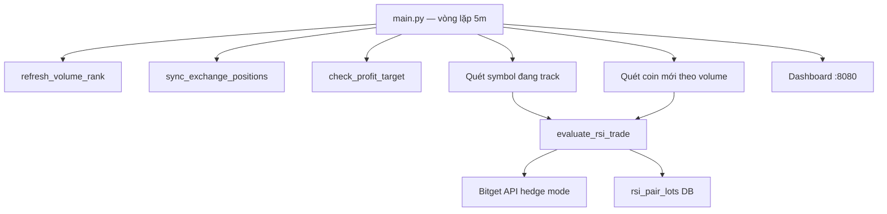
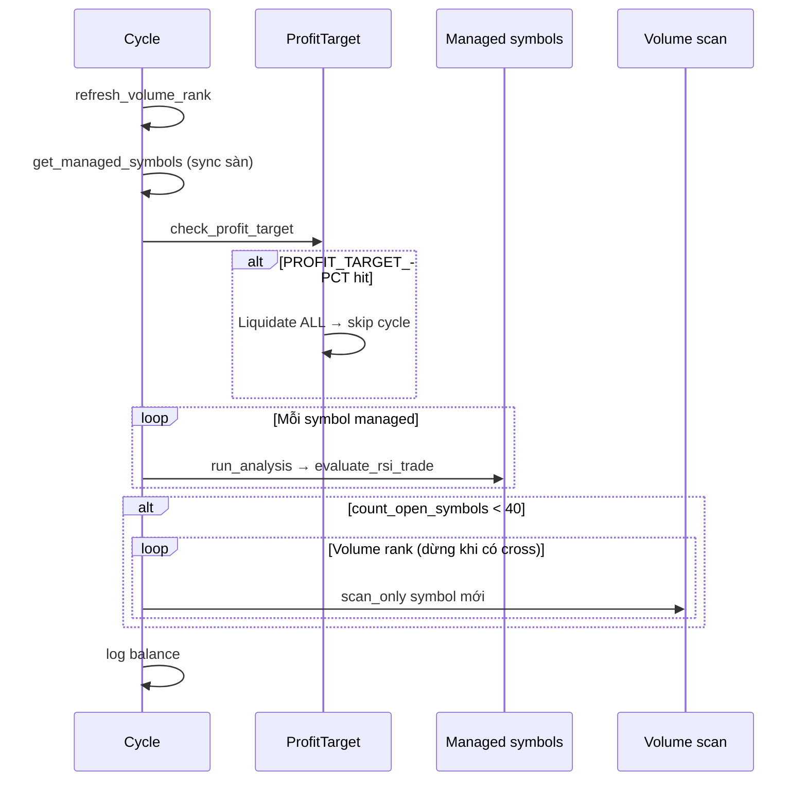
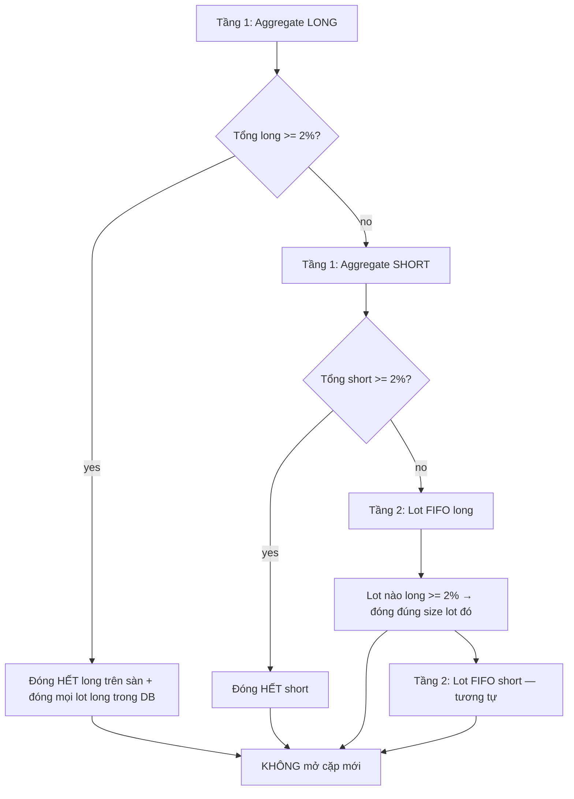

# Tổng hợp logic bot RSI hedged (Bitget USDT-M)

Bot chạy vòng **5 phút**, chiến lược **cặp long + short** (hedge mode), tín hiệu **RSI(14)** trên nến **5m**, chốt lãi theo **% giá** (mặc định 2%).

---

## 1. Kiến trúc tổng quan



| Thành phần | Vai trò |
|------------|---------|
| `main.py` | Điều phối cycle, scan, log balance |
| `rsi_trading.py` | Mở/đóng cặp, chốt lãi, stack |
| `rsi_signals.py` | RSI cross, công thức 2% |
| `rsi_positions.py` | Sync sàn ↔ DB, danh sách symbol quản lý |
| `order_sizing.py` | Tính margin/size từ equity |
| `database.py` | Bảng `rsi_pair_lots` — FIFO từng lần vào cặp |
| `bitget_client.py` | Hedge mode, long/short riêng |

**Đã bỏ:** RSI 1 chiều, DCA, thoát RSI 75/25, manual hold.

---

## 2. Khởi động (`python -m src.main`)

1. `init_db()` — tạo/migrate DB (`rsi_pair_lots`, …)
2. `restore_tracked_positions()` — log lot đang mở từ DB
3. `refresh_volume_rank()` — load ranking volume USDT-M
4. Bật **dashboard** FastAPI port `WEB_PORT` (8080)
5. Vòng lặp vô hạn: `run_cycle()` → sleep đến **mốc 5 phút** tiếp theo

**Yêu cầu:** API Bitget + **hedge mode** trên tài khoản. `TRADING_ENABLED=false` → chỉ sync/dashboard, không đặt lệnh.

---

## 3. Một cycle 5 phút (`run_cycle`)



**Thứ tự:**

1. Refresh volume rank (~600+ perpetual)
2. **Sync** vị thế sàn → cập nhật danh sách symbol đang track
3. Nếu `PROFIT_TARGET_PCT > 0` và unrealized/equity đạt ngưỡng → **đóng hết** mọi symbol, reset baseline, **bỏ qua** cycle
4. Với **mỗi symbol đang track**: tính RSI + `evaluate_rsi_trade` (luôn chạy, kể cả không cross)
5. Nếu còn slot symbol (`< 40`): quét volume từ đầu, **dừng ngay** coin đầu tiên có RSI cross (mở cặp qua bước 4 của symbol đó)
6. Log balance + cập nhật dashboard state

**Symbol được track** = có lot open trong DB **hoặc** còn size trên sàn (sau `sync_exchange_positions`).

---

## 4. Sử dụng vốn (sizing)

Công thức trong `order_sizing.py`:

| Bước | Công thức |
|------|-----------|
| Margin mỗi **leg** | `max(ORDER_MARGIN_MIN_USDT, equity × ORDER_MARGIN_PCT / 100)` |
| Notional | `margin × LEVERAGE` |
| Size coin | `notional / price` (làm tròn theo contract spec Bitget) |

**Ví dụ** (`.env` mặc định): equity 200 USDT, `ORDER_MARGIN_PCT=0.5`, `LEVERAGE=10`

- Margin/leg = max(1, 200×0.5%) = **1 USDT**
- Notional/leg = 1×10 = **10 USDT**
- **Một cặp** (long + short) ≈ **2 USDT margin**, ~20 USDT notional tổng

Margin **tính lại mỗi lần** `_open_pair` theo equity lúc đó. Mỗi lot lưu `margin_usdt` tại thời điểm mở để dashboard/PnL.

**Giới hạn exposure (lý thuyết tối đa):**

- `MAX_OPEN_SYMBOLS=40` → tối đa **40 coin**
- Mỗi coin có thể **nhiều lot** (stack) → margin thực tế có thể cao hơn 40×2 leg nếu stack nhiều lần

---

## 5. Sàn Bitget — hedge mode

- `set_position_mode` → **hedge_mode** (long và short cùng symbol)
- Mỗi lệnh cần `holdSide` (long/short) + `tradeSide` (open/close)
- **Side Bitget hedge:** long luôn `buy`, short luôn `sell` (cả mở và đóng)
- `MARGIN_MODE=crossed`, `LEVERAGE=10` (config)

| Hành động | `side` | `tradeSide` | `holdSide` |
|-----------|--------|-------------|------------|
| Mở long | `buy` | `open` | `long` |
| Mở short | `sell` | `open` | `short` |
| Đóng long | `buy` | `close` | `long` |
| Đóng short | `sell` | `close` | `short` |

Mở cặp: market open long + market open short cùng size.  
Đóng: `close_position_side(symbol, hold_side, size)` — reduce theo size lot hoặc toàn bộ phía aggregate.

Sau đóng có `_verify_side_reduced` — log lỗi nếu size không giảm.

---

## 6. Tín hiệu RSI

- Nến **5m** đã đóng, RSI **14** (Wilder)
- Cần tối thiểu `RSI_PERIOD + 2` nến

| Cross | Điều kiện | Trigger |
|-------|-----------|---------|
| **cross↑25** | `prev_rsi ≤ 25` và `rsi > 25` | `rsi_cross_25` |
| **cross↓75** | `prev_rsi ≥ 75` và `rsi < 75` | `rsi_cross_75` |

`cross↑75` và `cross↓25` **không** dùng để vào/ra lệnh (chỉ log).

**Gate giao dịch:** chỉ `cross↑25` **hoặc** `cross↓75` mới kích hoạt nhánh **mở cặp / stack / TP cross**.  
Nhưng **chốt lãi cycle** chạy **mọi cycle** dù không có cross.

**Công thức % giá (chốt 2%):**

- Long: `(mark - entry) / entry × 100`
- Short: `(entry - mark) / entry × 100`

`should_take_profit()` = move ≥ `PAIR_PROFIT_TARGET_PCT` (2%).

---

## 7. Vào lệnh — mở cặp long + short

Hàm `_open_pair(symbol, snap, trigger)`:

1. Lấy equity → tính margin/leg → size
2. Market **open long** + market **open short** (cùng size)
3. Ghi `insert_pair_lot` — 1 **lot** mới trong DB:
   - `long_size`, `long_entry`, `long_status=open`
   - `short_size`, `short_entry`, `short_status=open`
   - `margin_usdt`, `entry_trigger`, `opened_at`

**Khi nào mở cặp:**

| Tình huống | Trigger ví dụ |
|------------|----------------|
| Symbol **mới**, còn slot, có cross | `rsi_cross_25` / `rsi_cross_75` |
| Symbol **đã có lot**, cross nhưng **không** chốt lãi | `rsi_cross_25_stack` |
| Chốt lãi trên **cross** (xem mục 8) | `rsi_cross_75_tp_agg_long`, `..._tp_lot3_short`, … |

**Scan coin mới:** duyệt volume rank; coin đầu tiên cross → mở cặp → **dừng scan** (1 coin/cycle từ scan).

---

## 8. Chốt lãi — hai tầng, hai thời điểm

Ngưỡng: `PAIR_PROFIT_TARGET_PCT` (mặc định **2%** theo **giá**, không phải ROI ký quỹ).

### 8a. Mỗi cycle 5 phút (`trigger=cycle`, `reopen_pair=False`)

Chạy **sau sync**, cho **mọi** symbol managed — **không cần RSI cross**.

Thứ tự `_scan_take_profits`:



- **Aggregate:** dùng `avg_price` + tổng `size` từ sàn
- **Lot:** FIFO `opened_at ASC`; đóng **đúng** `lot.long_size` / `lot.short_size`; phía còn lại của lot giữ nguyên
- Có thể chốt **nhiều lot** trong cùng một cycle
- **Không** `_open_pair` sau chốt

### 8b. Khi RSI cross (`reopen_pair=True`)

Cùng logic aggregate → lot FIFO, nhưng **sau mỗi lần chốt** → **`_open_pair`** (mở cặp mới).

Nếu **có bất kỳ** chốt lãi nào trên cross → **return**, **không** stack thêm.

Nếu **không** chốt trên cross:

- Đã có lot → **stack** thêm 1 cặp (`{trigger}_stack`)
- Chưa có lot + còn slot → **entry đầu**
- Đủ 40 symbol → skip

### So sánh cycle vs cross

| | Mỗi cycle 5m | RSI cross |
|---|--------------|-----------|
| Chốt aggregate/lot | Có | Có |
| Sau chốt | **Không** mở cặp | **`_open_pair`** |
| Không chốt | Không làm gì thêm | Stack hoặc entry |

### Ví dụ lot FIFO

- Lot #1 long +0.3%, lot #2 long +3%: aggregate chưa 2% → chỉ chốt **long lot #2** (đúng size lot #2)
- Nếu aggregate long ≥2% → chốt **toàn bộ** long (cả lot chưa đủ 2%)

---

## 9. `evaluate_rsi_trade` — luồng đầy đủ

```
1. Sync lot vs sàn (_sync_lots_with_exchange — warning nếu lệch)
2. Cập nhật bot_state / dashboard (RSI, mark, size)
3. _scan_take_profits(trigger="cycle", reopen_pair=False)

Nếu có RSI cross 25/75:
4. _scan_take_profits(trigger=rsi_cross_*, reopen_pair=True)
5. Nếu đã chốt ở bước 4 → return (không stack thêm)
6. Nếu không chốt:
   - Symbol đã có lot → stack thêm 1 cặp ({trigger}_stack)
   - Symbol mới + count_open_symbols() < 40 → entry cặp đầu
   - Đầy 40 symbol → skip, log
```

---

## 10. Quản lý lệnh — DB `rsi_pair_lots`

Mỗi lần `_open_pair` = **1 lot** (1 row):

| Cột | Ý nghĩa |
|-----|---------|
| `long_*` / `short_*` | size, entry, status (`open`/`closed`) |
| `margin_usdt` | margin/leg lúc mở |
| `entry_trigger` | `rsi_cross_25`, `stack`, `tp_agg_long`, `adopted`, … |
| `*_closed_at`, `*_realized_pnl_usdt` | PnL khi đóng từng phía |

**Đếm giới hạn:**

- `count_open_symbols()` — DISTINCT symbol có bất kỳ leg `open`
- `count_open_legs()` — tổng leg đang `open`

**Sync (`_sync_lots_with_exchange`):** so tổng size lot vs sàn; lệch → **log warning**, không tự sửa.

**Adopt:** vị thế trên sàn không có lot DB → tạo 1 lot `adopted` (margin legacy).

---

## 11. Giới hạn & scan

| Config | Mặc định | Ý nghĩa |
|--------|----------|---------|
| `MAX_OPEN_SYMBOLS` | 40 | Tối đa 40 coin có lot open |
| Volume scan | Toàn bộ USDT-M | Chỉ khi `count_open_symbols < 40` |

**Stack:** không giới hạn số lot/symbol — chỉ giới hạn **số symbol distinct**.

---

## 12. Chốt lời toàn portfolio (`PROFIT_TARGET_PCT`)

Tách với chốt 2%/leg:

- `PROFIT_TARGET_PCT=0` → **tắt** (mặc định)
- Nếu > 0: khi **tổng unrealized PnL / equity** ≥ ngưỡng → liquidate **tất cả** symbol managed, ghi `profit_takes`, reset baseline, skip cycle

Dashboard có nút trigger manual / reset baseline.

---

## 13. Dashboard

- Nhóm theo **symbol**: aggregate long/short sàn + bảng lot **FIFO**
- Badge **≥2%** (`tp_ready`) = leg sắp bị chốt ở cycle kế
- Lịch PnL theo từng **leg đóng** (`rsi_pair_lots`)
- API `/api/status` → `symbol_groups`

Manual hold UI đã **bỏ**.

---

## 14. Config `.env` quan trọng

```env
# Bắt buộc trade
BITGET_API_KEY=
BITGET_SECRET=
BITGET_PASSPHRASE=
TRADING_ENABLED=true

# Vốn
ORDER_MARGIN_PCT=0.5      # % equity mỗi leg
ORDER_MARGIN_MIN_USDT=1
LEVERAGE=10
MARGIN_MODE=crossed

# Chiến lược
MAX_OPEN_SYMBOLS=40
PAIR_PROFIT_TARGET_PCT=2   # Chốt lãi theo % giá
GRANULARITY=5m
INTERVAL_MINUTES=5
RSI_PERIOD=14
RSI_LONG_ENTRY=25          # cross↑25
RSI_SHORT_ENTRY=75         # cross↓75

PROFIT_TARGET_PCT=0        # Chốt toàn portfolio (0=off)
WEB_PORT=8080
DATABASE_PATH=data/bot.db
```

---

## 15. Vận hành thực tế

1. Bật **hedge mode** trên Bitget; đóng vị thế **one-way** cũ nếu có
2. `TRADING_ENABLED=true` → lệnh thật
3. Restart bot sau đổi code/config
4. `clear_dashboard_history()` có sẵn trong DB — xóa lịch sử lot, không xóa vị thế sàn

---

## 16. Tóm tắt hành vi

Bot **mỗi 5 phút** sync và **quét chốt ≥2%** mọi leg (chỉ đóng, không mở thêm). Khi **RSI cắt 25 hoặc 75**, nếu đủ điều kiện thì **chốt + mở lại cặp**, hoặc **stack cặp** nếu không chốt. Mỗi lần vào dùng **0.5% equity/leg**, tối đa **40 coin**, hedge **long+short** song song, theo dõi từng lần vào bằng **lot FIFO** trong DB.

---

## File tham chiếu

| File | Nội dung chính |
|------|----------------|
| `src/main.py` | Vòng lặp 5m, scan volume |
| `src/rsi_trading.py` | `_scan_take_profits`, `evaluate_rsi_trade`, `_open_pair` |
| `src/rsi_signals.py` | `detect_pair_event`, `should_take_profit` |
| `src/rsi_positions.py` | `sync_exchange_positions`, adopt |
| `src/order_sizing.py` | `compute_entry_margin_usdt` |
| `src/bitget_client.py` | Hedge orders, `_market_order_side` |
| `src/database.py` | `rsi_pair_lots`, `clear_dashboard_history` |
| `src/profit_target.py` | Chốt toàn portfolio |
| `src/web/app.py` | Dashboard `symbol_groups` |
