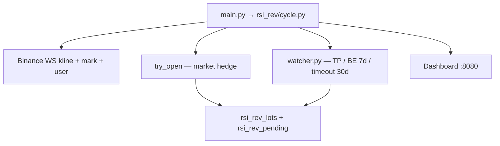
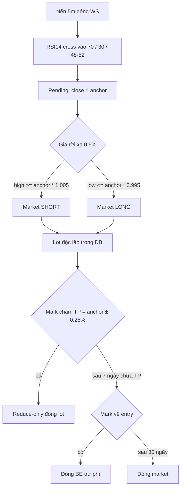

 
# Bot RSI-anchor mean reversion (USDT-M)

Bot chạy vòng **5 phút**, chiến lược **RSI reversion** trên nến **5m**: khi RSI14 **vừa vào** vùng 70 / 30 / 48–52, lưu **anchor = close** nến đó; khi giá **rời 0.5%** thì vào **LONG hoặc SHORT** (song song, stack lot). Thoát: **TP về anchor ± 0.25%**, **BE sau 7 ngày**, **timeout 30 ngày**.

Version hiện tại trade **LINKUSDT, SUIUSDT, WLDUSDT, HYPEUSDT**. Env `RSI_REV_SYMBOLS` (comma-separated).

Hỗ trợ **Bitget** hoặc **Binance** USDT-M qua `EXCHANGE=bitget|binance`. Binance ưu tiên **WebSocket** (kline 5m, mark price, user-data); REST chỉ khi cache thiếu (listenKey / warmup nến / equity fallback) hoặc đặt lệnh.

**Entry point:** `python -m src.main` → `src/rsi_rev/cycle.py`

---

## 0. Multi-exchange

| Env | Ý nghĩa |
|-----|---------|
| `EXCHANGE=bitget` | Bitget USDT-M |
| `EXCHANGE=binance` | Binance USDT-M (`fapi.binance.com`) |
| `BITGET_*` | API key Bitget (passphrase bắt buộc) |
| `BINANCE_API_KEY` / `BINANCE_SECRET_KEY` | API key Binance Futures |

Code: [`src/exchange/`](src/exchange/) — facade; Bitget bọc [`src/bitget_client.py`](../src/bitget_client.py); Binance tại [`src/exchange/binance.py`](../src/exchange/binance.py).

---

## 1. Kiến trúc


```mermaid
flowchart TB
    main["main.py → rsi_rev/cycle.py"]
    main --> ws["Binance WS kline + mark + user"]
    main --> entry["try_open — market hedge"]
    main --> watcher["watcher.py — TP / BE 7d / timeout 30d"]
    entry --> db["rsi_rev_lots + rsi_rev_pending"]
    main --> web["Dashboard :8080"]
    watcher --> db
```

| Module | Vai trò |
|--------|---------|
| `src/rsi_rev/cycle.py` | Vòng 5m: WS kline LINK, pending, mở hết tín hiệu nến, log equity |
| `src/rsi_rev/signals.py` | RSI14 event 70/30/50, trigger rời 0.5%, thứ tự thoát |
| `src/rsi_rev/trading.py` | Market open hedge; size 0.5% equity × 10x; skip nếu thiếu số dư; reduce-only đóng lot |
| `src/rsi_rev/watcher.py` | Mark WS mỗi 2s: TP / BE sau 7 ngày / timeout 30 ngày |
| `src/rsi_rev/store.py` | SQLite `rsi_rev_pending` + `rsi_rev_lots` |
| `src/rsi_rev/candles.py` | WS kline 5m; REST warmup nền nếu cache < ~20 nến, cách nhau `REST_BOOT_GAP_SEC` |
| `src/exchange/` | REST + WS, hedge orders |
| `src/web/app.py` | Dashboard RSI-rev |

---

## 2. Tín hiệu vào lệnh

Nguồn sự thật: backtest [`scripts/backtest_link_rsi_reversion_parallel.py`](../scripts/backtest_link_rsi_reversion_parallel.py).


```mermaid
flowchart TD
    kline["Nến 5m đóng WS"] --> rsi["RSI14 cross vào 70 / 30 / 48-52"]
    rsi --> anchor["Pending: close = anchor"]
    anchor --> leave{"Giá rời xa 0.5%"}
    leave -->|"high >= anchor * 1.005"| short["Market SHORT"]
    leave -->|"low <= anchor * 0.995"| long["Market LONG"]
    short --> hold["Lot độc lập trong DB"]
    long --> hold
    hold --> tp{"Mark chạm TP = anchor ± 0.25%"}
    tp -->|có| closeTp["Reduce-only đóng lot"]
    tp -->|"sau 7 ngày chưa TP"| be{"Mark về entry"}
    be -->|có| closeBe["Đóng BE trừ phí"]
    be -->|"sau 30 ngày"| closeAge["Đóng market"]
```

Quy tắc:

- Cả **3 vùng RSI** cùng chạy; long và short **song song**; stack lot khi rời 0.5% **và** còn đủ room tới TP.
- Event chỉ trên **nến đóng vừa rồi** (không lookahead).
- Entry = **close** nến rời 0.5%. Nếu close đã **vượt TP** hoặc còn **< 0.12%** tới TP (`RSI_REV_MIN_TP_ROOM_PCT`) thì **không mở** — pending giữ, chờ nến sau (tránh đóng ngay, lãi bị phí ăn hết).
- Cùng nến: **TP > BE**; BE chỉ sau 7 ngày; timeout 30 ngày đóng theo giá hiện tại.
- **Không** đặt SL cứng / algo SL-TP trên net position (sẽ cắt nhầm lot khác).

---

## 3. Sizing và giới hạn

| | Live (khớp backtest) |
|---|----------------------|
| Margin / lệnh | `0.5% equity hiện tại` (`RSI_REV_MARGIN_PCT`) |
| Leverage | 10x |
| Max lot đang mở | `RSI_REV_MAX_OPEN=0` = không cap |
| Lệnh mới / nến 5m | `RSI_REV_ENTRIES_PER_CYCLE=0` = hết tín hiệu trong nến |
| Thiếu số dư | **bỏ qua** lệnh (`cap_skip`), **không** giảm size; pending giữ lại |

Binance USDT-M hedge: 1 net LONG + 1 net SHORT / symbol. Nhiều lot = cộng dồn position. Đóng từng lot bằng **reduce-only** đúng `size` của lot.

Ví dụ equity 1000 USDT: 1 lệnh khóa **5 USDT** margin, notional **50 USDT**.

---

## 4. WS-first / rate limit

- Subscribe `{symbol}@kline_5m` cho từng coin trong `RSI_REV_SYMBOLS` + `!markPrice@arr@1s` + user data.
- **Không** scan top 50, **không** `refresh_volume_rank` mỗi cycle.
- Cycle đầu: skip REST reconcile.
- Boot: **không** chặn REST 10 phút. Optional REST (listenKey nếu chưa có file, kline warmup nếu thiếu nến, account nếu chưa có disk) **cách nhau 60s** (`REST_BOOT_GAP_SEC`) và **skip khi weight ≥ 800**. Critical order không chờ gap.
- Equity: cache user-stream nếu fresh; REST `/fapi/v2/account` chỉ khi cache stale **và** không `is_optional_rest_blocked`.
- Watcher **không** poll REST klines; dùng mark WS. REST position chỉ khi lệch size DB vs sàn.
- `set_watched_symbols(RSI_REV_SYMBOLS)` — hiện LINK, SUI, WLD, HYPE.

---

## 5. Dashboard / Discord

Dashboard ([`src/web/app.py`](../src/web/app.py)):

- Số lệnh mở / đóng, pending anchors, unrealized (mark WS), realized **đã trừ phí** (USDT commission từ user-stream `n`/`N`).
- Lịch sử vị thế dạng thẻ giống Binance: Mua/Bán, Vĩnh cửu, Cross 10x, PnL đã ghi nhận, ROI (PnL / ký quỹ), khối lượng, giá vào/đóng TB, thời gian giữ. Lệnh mở hiện PnL chưa ghi nhận + mark.
- Lot cũ (trước khi lưu phí) giữ PnL giá; lệnh mới trừ phí mở + phí đóng.
- Thống kê theo **ngày VN**, ngày mới nhất trên cùng.
- Phân trang riêng open/closed; trang 1 = mới nhất. `GET /api/rsi-rev/trades?status=open|closed&page=&page_size=` và `GET /api/rsi-rev/daily?days=30`.

Discord: mỗi lot **mở** (anchor + target + size) và **đóng** với lý do `TP về vùng RSI` | `Break-even sau 7 ngày` | `Timeout 30 ngày`. Fail-soft. Không REST fetch balance trong notify nếu cache WS fresh. **Lỗi runtime** (cycle, watcher, uncaught exception, ERROR log) cũng notify Discord (`Bot lỗi: …`).

---

## 6. SQLite

| Bảng | Việc |
|------|------|
| `rsi_rev_pending` | Setup chờ rời 0.5%; unique `(symbol, anchor_ts, zone)` |
| `rsi_rev_lots` | Lot mở/đóng; `pnl_usdt` net sau phí; `fee_open_usdt` / `fee_close_usdt` |
| `rsi_rev_skips` | Skip hết số dư / max open / TP room quá hẹp |
| `equity_snapshots` | Chart equity dashboard |

`clear_dashboard_history()` — xóa lịch sử RSI-rev + equity chart (không đóng vị thế sàn).

---

## 7. Env chính

```
EXCHANGE=binance
SYMBOL=LINKUSDT
RSI_REV_SYMBOLS=LINKUSDT,SUIUSDT,WLDUSDT,HYPEUSDT
RSI_REV_MARGIN_PCT=0.5
LEVERAGE=10
RSI_REV_MAX_OPEN=0
RSI_REV_ENTRIES_PER_CYCLE=0
RSI_REV_MOVE_AWAY_PCT=0.005
RSI_REV_ZONE_PCT=0.0025
RSI_REV_MIN_TP_ROOM_PCT=0.0012
RSI_REV_BE_AFTER_HOURS=168
RSI_REV_MAX_AGE_DAYS=30
GRANULARITY=5m
INTERVAL_MINUTES=5
TRADING_ENABLED=true
```

---

## 8. File map

| File | Việc |
|------|------|
| `src/main.py` | Entry → `rsi_rev.cycle.main()` |
| `src/rsi_rev/cycle.py` | Vòng lặp 5m |
| `src/rsi_rev/signals.py` | RSI event + trigger + thứ tự thoát |
| `src/rsi_rev/trading.py` | Open/close, sizing, skip hết số dư |
| `src/rsi_rev/watcher.py` | Mark WS TP/BE/timeout |
| `src/rsi_rev/store.py` | SQLite schema + CRUD |
| `src/web/app.py` | Dashboard + API |
