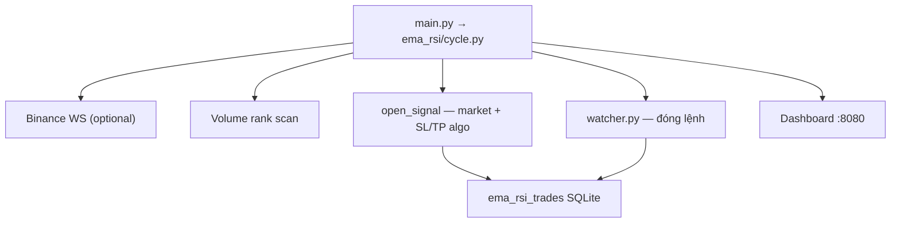

# Bot EMA200 + RSI swing (USDT-M)

Bot chạy vòng **5 phút**, chiến lược **một chiều** (long hoặc short), tín hiệu **EMA200 + RSI swing** trên nến **5m**, thoát bằng **SL/TP algo** (RR 1:2).

Hỗ trợ **Bitget** hoặc **Binance** USDT-M qua `EXCHANGE=bitget|binance`.

**Entry point:** `python -m src.main` → `src/ema_rsi/cycle.py`

---

## 0. Multi-exchange

| Env | Ý nghĩa |
|-----|---------|
| `EXCHANGE=bitget` | Bitget USDT-M |
| `EXCHANGE=binance` | Binance USDT-M (`fapi.binance.com`) |
| `BITGET_*` | API key Bitget (passphrase bắt buộc) |
| `BINANCE_API_KEY` / `BINANCE_SECRET_KEY` | API key Binance Futures |

Code: [`src/exchange/`](src/exchange/) — facade; Bitget bọc [`src/bitget_client.py`](../src/bitget_client.py); Binance tại [`src/exchange/binance.py`](../src/exchange/binance.py).

---

## 1. Kiến trúc


```mermaid
flowchart TB
    main["main.py → ema_rsi/cycle.py"]
    main --> ws["Binance WS (optional)"]
    main --> scan["Volume rank scan"]
    main --> entry["open_signal — market + SL/TP algo"]
    main --> watcher["watcher.py — đóng lệnh"]
    entry --> db["ema_rsi_trades SQLite"]
    main --> web["Dashboard :8080"]
    watcher --> db
```

| Module | Vai trò |
|--------|---------|
| `src/ema_rsi/cycle.py` | Vòng 5m: scan, mở lệnh, log balance/equity |
| `src/ema_rsi/signals.py` | EMA cross + RSI zone, tính SL/TP |
| `src/ema_rsi/trading.py` | Mở/đóng, sizing, algo SL/TP, orphan reconcile |
| `src/ema_rsi/watcher.py` | Theo dõi fill SL/TP qua WS + REST confirm |
| `src/ema_rsi/store.py` | SQLite `ema_rsi_trades`, dedupe signal |
| `src/exchange/` | REST + WS, hedge orders, algo orders |
| `src/web/app.py` | Dashboard EMA-RSI |

---

## 2. Tín hiệu vào lệnh

**Khung:** nến 5m đã đóng.

**Long:**
1. Trong cùng swing trước đó, RSI(14) đã **< 25**
2. Nến hiện tại **đóng cửa cắt lên** EMA200 (cross up)
3. SL = **đáy thấp nhất** trong vùng RSI < 25
4. TP = entry + 2×R (RR 1:2)

**Short:** đối xứng — RSI **> 75**, cross **xuống** EMA200, SL = **đỉnh cao nhất** vùng RSI > 75.

**Bỏ qua nếu:**
- SL sai phía (long: SL ≥ entry; short: SL ≤ entry)
- Symbol đã có position (DB hoặc sàn)
- Đạt `EMA_RSI_MAX_OPEN` (mặc định 20)
- Signal candle đã xử lý (`ema_rsi_seen_signals`)
- **Entry confirm fail:** WS kline chưa fresh → bắt buộc REST klines; signal không khớp sau confirm → skip (`signal_mismatch`, `candles_unconfirmed`, …)

---

## 3. Sizing

| Bước | Công thức |
|------|-----------|
| Equity | REST `/fapi/v2/account` mỗi lần vào lệnh (không dùng cache WS) |
| Margin | `max(MIN, equity × EMA_RSI_MARGIN_PCT / 100)` — mặc định **1%** |
| Notional | `margin × LEVERAGE` |
| Size | `notional / entry` (làm tròn theo contract spec) |

Mặc định: `LEVERAGE=10`, `EMA_RSI_MARGIN_PCT=1` → equity 1000 USDT → margin 10 USDT → notional 100 USDT.

---

## 4. Thực thi lệnh

1. `configure_symbol_trading` — cross margin + leverage
2. Market open (long hoặc short, hedge mode)
3. Đặt **STOP_MARKET** (SL) và **TAKE_PROFIT_MARKET** (TP) qua `/fapi/v1/algoOrder`
4. Ghi DB + Discord notify mở lệnh

**Một symbol = một vị thế** — không stack, không flip.

---

## 5. Đóng lệnh (watcher)

Thread riêng (`EMA_RSI_WATCHER_INTERVAL_SEC`, mặc định 2s):

- Chỉ đóng DB khi **REST xác nhận position flat** (tránh false close từ WS stale)
- SL/TP algo phải **filled** (không coi `triggered` là đóng xong)
- Hủy lệnh còn lại (TP khi hit SL, SL khi hit TP) sau khi position thật sự flat
- **Orphan reconcile:** nếu DB closed nhưng sàn còn position → reopen + đặt lại SL/TP thiếu

Discord notify khi hit SL / TP / invalid SL.

**Discord lỗi** (`notify_error`, cooldown 180s / context; REST ban 900s):
- Cycle 5m crash, watcher crash
- Mở lệnh fail, equity REST = 0, SL/TP algo fail, flatten fail
- Restore SL/TP fail, re-adopt orphan
- Volume rank fail / empty, WS start fail, kline WS không connect
- REST 418/429 ban, fill order không resolve được
- Binance WS disconnect lâu

---

## 6. Cycle 5 phút

1. Refresh volume rank (top USDT perpetuals)
2. Sync WS klines cho symbol đang mở + top scan
3. `reconcile_orphan_positions()` + `reconcile_open_trades()`
4. Scan top-N coin (mặc định 50) **chỉ qua WS** — bỏ qua symbol chưa `kline_fresh`; không REST klines khi scan
5. Trước mở lệnh: **REST confirm nến** chỉ khi có signal và WS kline chưa fresh (tối đa 3 REST/cycle)
6. Log balance + ghi `equity_snapshots`

**Startup:** chờ miniTicker + kline WS connect, pre-subscribe top scan symbols (~2s) trước cycle đầu.

Sleep đến mốc 5 phút tiếp theo.

---

## 7. Binance WebSocket

`BINANCE_WS_ENABLED=true` (mặc định):

| Stream | Dùng cho |
|--------|----------|
| `!miniTicker@arr` | Volume rank |
| `!markPrice@arr@1s` | Mark price dashboard + unrealized PnL |
| `{symbol}@kline_5m` | Tín hiệu (ưu tiên WS, fallback REST) |
| User data stream | Position/order updates, fill detection |

REST vẫn dùng cho: đặt lệnh, algo SL/TP, equity sizing, confirm position flat.

---

## 8. Dashboard (`WEB_PORT=8080`)

- Bảng lệnh EMA-RSI (open + closed)
- Summary PnL (unrealized / realized)
- Biểu đồ equity (24h / 7d / 30d)
- Start/Stop trading
- Đăng nhập bắt buộc (`DASHBOARD_USERNAME` / `DASHBOARD_PASSWORD`)

API:
- `GET /api/status` — account + trades
- `GET /api/ema-rsi/trades`
- `GET /api/equity-history?range=24h|7d|30d`

---

## 9. Database

| Bảng | Mục đích |
|------|----------|
| `ema_rsi_trades` | Lệnh bot (entry, sl, tp, status, pnl, order ids) |
| `ema_rsi_seen_signals` | Dedupe signal theo (symbol, signal_ts) |
| `equity_snapshots` | Chart equity mỗi cycle |
| `settings` | `trading_enabled`, baseline equity |

`clear_dashboard_history()` — xóa lịch sử EMA-RSI + equity chart (không đóng vị thế sàn).

---

## 10. Config `.env`

```env
EXCHANGE=binance
BINANCE_API_KEY=
BINANCE_SECRET_KEY=
BINANCE_WS_ENABLED=true

TRADING_ENABLED=true
LEVERAGE=10

# EMA-RSI strategy
EMA_RSI_EMA_PERIOD=200
EMA_RSI_RSI_PERIOD=14
EMA_RSI_RSI_LOW=25
EMA_RSI_RSI_HIGH=75
EMA_RSI_RR=2
EMA_RSI_MARGIN_PCT=1
EMA_RSI_MAX_OPEN=20
EMA_RSI_SCAN_LIMIT=50
EMA_RSI_ENTRIES_PER_CYCLE=3
EMA_RSI_WATCHER_INTERVAL_SEC=2

GRANULARITY=5m
INTERVAL_MINUTES=5
MIN_LISTING_AGE_DAYS=30

# Dashboard
WEB_PORT=8080
DASHBOARD_USERNAME=
DASHBOARD_PASSWORD=
DASHBOARD_SESSION_SECRET=
DASHBOARD_COOKIE_SECURE=true

# Discord
DISCORD_WEBHOOK_URL=

DATABASE_PATH=data/bot.db
```

---

## 11. File tham chiếu

| File | Nội dung |
|------|----------|
| `src/main.py` | Entry → `ema_rsi.cycle.main()` |
| `src/ema_rsi/cycle.py` | Vòng lặp 5m |
| `src/ema_rsi/signals.py` | Logic EMA + RSI zone |
| `src/ema_rsi/trading.py` | Open/close, sizing, protective orders |
| `src/ema_rsi/watcher.py` | SL/TP fill detection |
| `src/ema_rsi/store.py` | SQLite schema + CRUD |
| `src/exchange/binance.py` | Algo orders, REST |
| `src/exchange/binance_ws/` | WS cache |
| `src/exchange/fills.py` | `resolve_order_fill` |
| `src/database.py` | Settings + equity snapshots |
| `src/web/app.py` | Dashboard |
