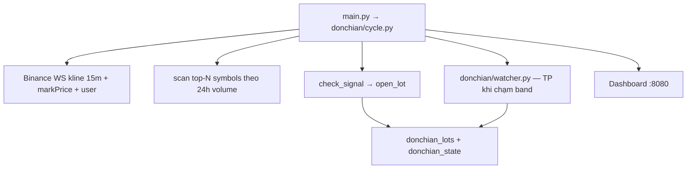
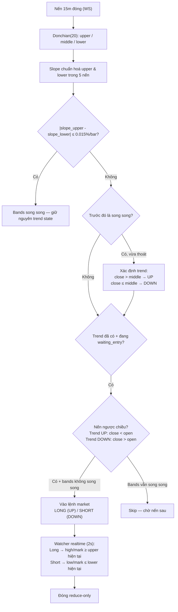

# Bot Donchian Parallel-Trend (USDT-M)

Bot chạy vòng **15 phút**, chiến lược **Donchian parallel-trend** trên nến **15m**: khi 2 band trên/dưới của Donchian Channel **chuyển từ song song sang không song song**, xác định xu hướng theo vị trí close so với band giữa; đợi nến ngược chiều → vào lệnh; thoát khi giá chạm band Donchian đối ứng.

**Entry point:** `python -m src.main` → `src/donchian/cycle.py`

---

## 0. Multi-exchange

| Env | Ý nghĩa |
|-----|---------|
| `EXCHANGE=binance` | Binance USDT-M (`fapi.binance.com`) |
| `BINANCE_API_KEY` / `BINANCE_SECRET_KEY` | API key Binance Futures |

---

## 1. Kiến trúc


```mermaid
flowchart TB
    main["main.py → donchian/cycle.py"]
    main --> ws["Binance WS kline 15m + markPrice + user"]
    main --> scan["scan top-N symbols theo 24h volume"]
    main --> entry["check_signal → open_lot"]
    main --> watcher["donchian/watcher.py — TP khi chạm band"]
    entry --> db["donchian_lots + donchian_state"]
    main --> web["Dashboard :8080"]
    watcher --> db
```

| Module | Vai trò |
|--------|---------|
| `src/donchian/cycle.py` | Vòng 15m: scan top-N symbols, detect signal, mở lệnh |
| `src/donchian/signals.py` | Donchian bands, parallel flag, check_signal per symbol |
| `src/donchian/trading.py` | Market open/close; size 0.5% equity × 10x |
| `src/donchian/watcher.py` | Mark WS mỗi 2s: TP khi chạm band Donchian |
| `src/donchian/store.py` | SQLite `donchian_lots` + `donchian_state` |
| `src/exchange/` | REST + WS, rate limit, cache — giữ nguyên |
| `src/web/app.py` | Dashboard Donchian |

---

## 2. Logic tín hiệu


```mermaid
flowchart TD
    kline["Nến 15m đóng (WS)"] --> dc["Donchian(20): upper / middle / lower"]
    dc --> slope["Slope chuẩn hoá upper & lower trong 5 nến"]
    slope --> parallel{"|slope_upper - slope_lower| ≤ 0.015%/bar?"}
    parallel -->|Có| wait["Bands song song — giữ nguyên trend state"]
    parallel -->|Không| exit_check{"Trước đó là song song?"}
    exit_check -->|Có, vừa thoát| trend["Xác định trend:\nclose > middle → UP\nclose ≤ middle → DOWN"]
    exit_check -->|Không| entry_check
    trend --> entry_check{"Trend đã có + đang waiting_entry?"}
    entry_check -->|Có| counter{"Nến ngược chiều?\nTrend UP: close < open\nTrend DOWN: close > open"}
    counter -->|Có + bands không song song| open["Vào lệnh market\nLONG (UP) / SHORT (DOWN)"]
    counter -->|Bands vẫn song song| skip["Skip — chờ nến sau"]
    open --> tp["Watcher realtime (2s):\nLong → high/mark ≥ upper hiện tại\nShort → low/mark ≤ lower hiện tại"]
    tp --> close["Đóng reduce-only"]
```

**Quy tắc chi tiết:**

- Donchian period: **20 nến** · slope lookback: **5 nến** · parallel tolerance: **0.015 %/bar**
- Trend được xác định tại nến **đầu tiên** sau khi bands thoát trạng thái song song.
- `waiting_entry = True` sau khi xác định trend; reset khi vào lệnh hoặc khi có lệnh đang mở (`MAX_OPEN` đã đạt).
- `tp_band` lưu band lúc **entry** (hiển thị / fallback nếu cache thiếu nến). Watcher thoát theo **Donchian đang chạy** giống backtest: long khi high/mark nến hiện tại ≥ **upper hiện tại**, short khi low/mark ≤ **lower hiện tại**. Không TP trên **nến vào lệnh** (giống backtest). Khác backtest: kiểm tra mỗi 2s trên nến đang chạy, **không** đợi đóng nến.

**Khung nến:** `DONCHIAN_INTERVAL` (mặc định `15m`) **ghi đè** `GRANULARITY` / `INTERVAL_MINUTES`. WS kline, REST seed và stale-check phải cùng khung — nếu WS 5m mà bot tính 15m thì cache bị drop, Donchian sai.
- Chỉ **1 lệnh mở / symbol tại 1 thời điểm** (MAX_OPEN global = 20).
- Không có SL cứng; thoát khi giá chạm band Donchian **hiện tại**.

---

## 3. Sizing và phí

| | Giá trị |
|---|---------|
| Margin / lệnh | `0.5% equity hiện tại` (`DONCHIAN_MARGIN_PCT`) |
| Leverage | `10x` |
| Max lệnh mở đồng thời | `20` (`DONCHIAN_MAX_OPEN`) |
| Phí taker Binance | `0.04%/chiều` |

**Công thức phí:**
```
phí ≈ 0.10% × vốn × đòn bẩy
    = 2 × 0.04% × leverage × margin
```
Ví dụ equity 1000 USDT: margin = 5 USDT, notional = 50 USDT → phí ≈ 0.10% × 50 = **0.05 USDT/lệnh** (cả 2 chiều).

---

## 4. Symbol scan động

Thay vì hardcode, bot scan **tất cả USDT-M futures** theo 24h quote volume từ WS cache (`!miniTicker@arr`):

- `DONCHIAN_TOP_N = 30` coin volume cao nhất
- Loại trừ: stablecoin (USDC, BUSD, FDUSD…), leverage token (UP/DOWN/BULL/BEAR)
- `set_watched_symbols(top_30)` → KlineStream tự subscribe/unsubscribe
- Không tốn REST để scan — dùng `CACHE.quote_volumes` đã có từ AllMarketStream

---

## 5. Boot sequence & rate limit safety

```
main() →
  init_db() + ensure_schema()
  mark_boot_rest_quiet()          ← chặn optional REST trong REST_BOOT_QUIET_SEC
  start_binance_ws()              ← AllMarket + Kline(top-30) + User stream
  _wait_binance_ws_ready()        ← block 30s chờ kline WS connected
  _start_boot_warmup(top_30)     ← daemon thread, tuần tự từng symbol
                                    boot_optional_rest_slot: gap REST_BOOT_GAP_SEC
                                    chỉ REST khi WS cache < 30 nến (DONCHIAN_PERIOD+LOOKBACK+5)
  start_watcher()                 ← donchian watcher mỗi 2s
  vòng lặp cycle 15m
```

**Rate limit protection (giữ nguyên từ bot cũ):**
- Warmup REST tuần tự — `boot_optional_rest_slot()` serialize 1 request/lần + `REST_BOOT_GAP_SEC` gap
- Trạng thái ban/grace persist vào disk, tự load khi restart
- Scan candles trong cycle: **WS-only**, không REST
- Critical orders (đặt/đóng lệnh) không bị block bởi rate limit

---

## 6. SQLite schema

| Bảng | Việc |
|------|------|
| `donchian_lots` | Lot mở/đóng; `pnl_usdt` net sau phí |
| `donchian_state` | Trend state per symbol (trend, trend_ts, waiting_entry) |
| `equity_snapshots` | Chart equity dashboard |

```sql
donchian_lots (
  id, symbol, side, trend, trend_ts,
  status ('open'|'closed'),
  entry_ts, entry_px, tp_band,
  size, margin_usdt, notional_usdt,
  entry_order_id,
  close_ts, close_px, close_reason,
  pnl_usdt, fee_open_usdt, fee_close_usdt,
  opened_at, closed_at
)

donchian_state (
  symbol PK, trend, trend_ts, waiting_entry, updated_at
)
```

---

## 7. Kết quả backtest

Khung **15m**, **1 năm** (19/8/2025 → 19/8/2026), vốn 1000 USDT, sizing 0.5%/lệnh × 10x.

| Coin | Thị trường | Lệnh/ngày | WR | PnL | % |
|------|-----------|-----------|-----|-----|---|
| LINKUSDT | -60% | 3.5 | 80% | +165.50 | +16.6% |
| SUIUSDT | -81% | 3.4 | 80% | +226.62 | +22.7% |
| DOGEUSDT | — | 3.4 | 79% | +150.34 | +15.0% |
| SOLUSDT | — | 3.5 | 79% | +145.11 | +14.5% |

- WR nhất quán **79–80%** trên cả 4 coin, qua cả bear trend -60 đến -81%
- PnL/ngày TB: **+0.40–0.62 USDT** / 1000 USDT vốn (sizing bảo thủ)
- Phí tổng 365 ngày: ~55 USDT (backtest script: `scripts/backtest_link_donchian_parallel_trend.py`)

---

## 8. Env vars

```
EXCHANGE=binance
BINANCE_API_KEY=...
BINANCE_SECRET_KEY=...

DONCHIAN_PERIOD=20
DONCHIAN_SLOPE_LB=5
DONCHIAN_PARALLEL_TOL=0.015
DONCHIAN_INTERVAL=15m
DONCHIAN_MARGIN_PCT=0.005
DONCHIAN_MAX_OPEN=20
DONCHIAN_TOP_N=30
LEVERAGE=10
TRADING_ENABLED=true
```

---

## 9. File map

| File | Việc |
|------|------|
| `src/main.py` | Entry → `donchian.cycle.main()` |
| `src/donchian/cycle.py` | Vòng lặp 15m, scan symbols, boot warmup |
| `src/donchian/signals.py` | Donchian bands, parallel flag, check_signal |
| `src/donchian/trading.py` | Open/close lot, sizing, skip logic |
| `src/donchian/watcher.py` | Mark WS TP check mỗi 2s |
| `src/donchian/store.py` | SQLite schema + CRUD |
| `src/web/app.py` | Dashboard + API |
