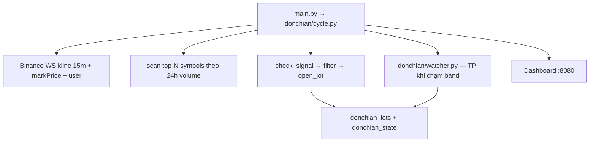
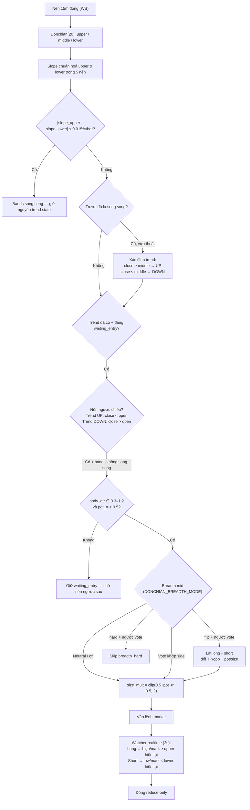
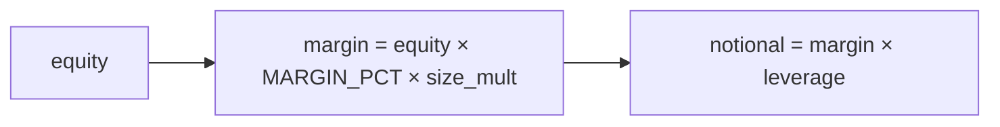

# Bot Donchian Parallel-Trend (USDT-M)

Bot chạy vòng **15 phút**, chiến lược **Donchian parallel-trend** trên nến **15m**: khi 2 band trên/dưới của Donchian Channel **chuyển từ song song sang không song song**, xác định xu hướng theo vị trí close so với band giữa; đợi nến ngược chiều → lọc body ATR + pot RR → vào lệnh với `size_mult`; **breadth mid flip** (mặc định): nếu tín hiệu ngược đa số coin trên/dưới mid thì **lật side** rồi vẫn vào (neutral = cả hai); thoát khi giá chạm band Donchian hiện tại (không SL cứng).

**Entry point:** `python -m src.main` → `src/donchian/cycle.py`

Cấu hình live khớp backtest **breadth_flip + skim spot** (paper 365d, vốn 1000$: total **~18.6×**, MaxDD total **~16%**, lãi TB **~+1.3%/ngày** trên vốn bot đầu ngày — $/ngày = SOD × ~1.3%; xem §7.3). Chi tiết flip thuần / 3 năm: §7.1b–c.

---

## 0. Multi-exchange

| Env | Ý nghĩa |
|-----|---------|
| `EXCHANGE=binance` | Binance USDT-M (`fapi.binance.com`) |
| `BINANCE_API_KEY` / `BINANCE_SECRET_KEY` | API key Binance Futures |

---

## 1. Kiến trúc


```mermaid
flowchart TB
    main["main.py → donchian/cycle.py"]
    main --> ws["Binance WS kline 15m + markPrice + user"]
    main --> scan["scan top-N symbols theo 24h volume"]
    main --> entry["check_signal → filter → open_lot"]
    main --> watcher["donchian/watcher.py — TP khi chạm band"]
    entry --> db["donchian_lots + donchian_state"]
    main --> web["Dashboard :8080"]
    watcher --> db
```

| Module | Vai trò |
|--------|---------|
| `src/donchian/cycle.py` | Vòng 15m: scan top-N symbols, detect signal, mở lệnh |
| `src/donchian/signals.py` | Donchian bands, parallel, body/RR filter, `EntrySignal` |
| `src/donchian/trading.py` | Market open/close; margin = equity × 1% × size_mult |
| `src/donchian/watcher.py` | Mark WS mỗi 2s: TP khi chạm band Donchian |
| `src/donchian/store.py` | SQLite `donchian_lots` + `donchian_state` |
| `src/exchange/` | REST + WS, rate limit, cache — giữ nguyên |
| `src/web/app.py` | Dashboard Donchian |

---

## 2. Logic tín hiệu


```mermaid
flowchart TD
    kline["Nến 15m đóng (WS)"] --> dc["Donchian(20): upper / middle / lower"]
    dc --> slope["Slope chuẩn hoá upper & lower trong 5 nến"]
    slope --> parallel{"|slope_upper - slope_lower| ≤ 0.015%/bar?"}
    parallel -->|Có| wait["Bands song song — giữ nguyên trend state"]
    parallel -->|Không| exit_check{"Trước đó là song song?"}
    exit_check -->|Có, vừa thoát| trend["Xác định trend:\nclose > middle → UP\nclose ≤ middle → DOWN"]
    exit_check -->|Không| entry_check
    trend --> entry_check{"Trend đã có + đang waiting_entry?"}
    entry_check -->|Có| counter{"Nến ngược chiều?\nTrend UP: close < open\nTrend DOWN: close > open"}
    counter -->|Có + bands không song song| filt{"body_atr ∈ 0.3–1.2\nvà pot_rr ≥ 0.5?"}
    filt -->|Không| keepWait["Giữ waiting_entry — chờ nến ngược sau"]
    filt -->|Có| breadth{"Breadth mid\n(DONCHIAN_BREADTH_MODE)"}
    breadth -->|Neutral / off| size["size_mult = clip(0.5+pot_rr, 0.5, 2)"]
    breadth -->|Vote khớp side| size
    breadth -->|flip + ngược vote| flip["Lật long↔short\nđổi TP/opp + pot/size"]
    breadth -->|hard + ngược vote| skipB["Skip breadth_hard"]
    flip --> size
    size --> open["Vào lệnh market"]
    open --> tp["Watcher realtime (2s):\nLong → high/mark ≥ upper hiện tại\nShort → low/mark ≤ lower hiện tại"]
    tp --> close["Đóng reduce-only"]
```

**Quy tắc vào lệnh:**

1. Donchian period **20** · slope lookback **5** · parallel tol **0.015 %/bar**.
2. Trend tại nến **đầu tiên** bands thoát song song (`close > middle` → UP, else DOWN) → `waiting_entry=True`.
3. Chờ **nến ngược chiều** trong khi bands vẫn **không** song song:
   - UP → nến đỏ (`close < open`) → LONG
   - DOWN → nến xanh (`close > open`) → SHORT
4. **Lọc chất lượng (body_size_rr05)** trước khi mở:
   - `body_atr = |close − open| / ATR(14)` ∈ **[0.3, 1.2]**
   - `pot_rr = dist(entry, TP band) / dist(entry, opposite band)` ≥ **0.5**
   - Fail → **không vào**, **giữ** `waiting_entry=True` (chờ counter sau)
5. Pass → `size_mult = clip(0.5 + pot_rr, 0.5, 2.0)`.
6. **Breadth mid** (`DONCHIAN_BREADTH_MODE`, mặc định **`flip`**):
   - Mỗi cycle: universe `majors` (mặc định) hoặc `scan`, đếm `close > Donchian mid` (up) vs `≤ mid` (down).
   - Vote **long** nếu ups ≥ downs × `DONCHIAN_BREADTH_RATIO` (1.3) và tot ≥ `DONCHIAN_BREADTH_MIN_N` (12); tương tự **short**.
   - Neutral (mẫu yếu / hòa) → cho cả hai phía như không có breadth.
   - **`flip` (live):** tín hiệu **ngược** vote → **lật** long↔short, đổi TP/opp band, tính lại `pot_rr` + `size_mult`, **vẫn mở** (không lọc lại pot ≥ 0.5 — khớp BT `breadth_flip`). Discord `why` ghi `breadth FLIP …`.
   - **`hard`:** ngược vote → skip `breadth_hard`, discard (BT cũ, MaxDD thấp hơn nhưng lãi ngày thấp hơn).
   - **`off`:** tắt breadth.
   - **Không** đóng / resize lot đang mở.
7. Mở market → watcher TP theo band live.

**Đóng lệnh:** không SL cứng. Watcher TP theo **band Donchian live** (long ≥ upper hiện tại, short ≤ lower hiện tại). `tp_band` lúc entry chỉ để hiển thị / fallback.

**Khác:**

- `waiting_entry` reset khi vào lệnh thành công, khi **symbol đó** đang có lot mở, hoặc `cap_skip` / `breadth_hard` — bỏ tín hiệu, không queue. Flip **không** discard. Chỉ retry khi `open_lot` lỗi sàn (`error`).
- Filter fail **không** clear `waiting_entry`.
- Chỉ **1 lot / symbol**; `DONCHIAN_MAX_OPEN` global (mặc định 20).
- Khung nến: `DONCHIAN_INTERVAL` (mặc định `15m`) ghi đè `GRANULARITY`.
- Breadth universe `majors`: WS subscribe thêm majors (kể cả ngoài top-N) để đủ mẫu mid.

### Discord khi mở lệnh

Notify giải thích **vì sao vào** + **vì sao size đó**, ví dụ:

```
LINKUSDT LONG mở — trend UP
lý do: thoát song song → UP; nến đỏ ngược chiều; band không song song
lọc: body_atr=0.72 (ok 0.3–1.2) · pot_rr=0.85 (≥0.5)
size: size_mult=1.35× · margin_pct=1.00% → margin=13.50 USDT (equity≈1000)
entry=...
target band=... · opp band=...
size=...
```

---

## 3. Sizing và phí


```mermaid
flowchart LR
    eq[equity] --> m["margin = equity × MARGIN_PCT × size_mult"]
    m --> n["notional = margin × leverage"]
```

| | Giá trị |
|---|---------|
| Base margin | **1% equity** (`DONCHIAN_MARGIN_PCT=0.01`) |
| Size scale | `size_mult` từ pot_rr khi `DONCHIAN_SIZE_BY_RR=true` |
| Margin thực tế | `equity × 0.01 × size_mult` (clip mult 0.5–2) |
| Leverage | `10x` |
| Max lệnh mở | `20` (`DONCHIAN_MAX_OPEN`) |
| Phí taker Binance | `0.04%/chiều` |

Ví dụ equity 1000 USDT, `size_mult=1.35`: margin = 13.50 USDT, notional = 135 USDT.

### Tương thích lệnh đang chạy (deploy)

**Giữ nguyên — không đóng, không resize, không áp filter mới lên lot đang mở.**

| Việc | Hành vi |
|------|---------|
| Lot `status=open` trong DB / trên sàn | Watcher vẫn TP theo band Donchian live |
| Size / margin lot cũ | Giữ lúc mở (vd. 0.5% cũ); **không** chỉnh lên 1% hay `size_mult` |
| Filter body / pot_rr | Chỉ khi **mở lệnh mới** |
| Breadth mid flip/hard | Chỉ khi **mở lệnh mới**; lot mở sẵn không bị đóng / lật |
| Cột DB mới (`body_atr`, `pot_rr`, `size_mult`, `opp_band`) | Lot cũ = `NULL`; close notify bỏ qua dòng meta nếu thiếu |
| Symbol đang có lot mở | `allow_entry=False` → không mở thêm |
| Sau khi lot cũ TP | Lệnh tiếp theo dùng rule mới + margin 1% + notify đầy đủ |

Restart bot sau deploy: reconcile lot mở như cũ; **không** force-flat. Production: set `DONCHIAN_MARGIN_PCT=0.01` trong `.env` rồi restart nếu file cũ còn `0.005`.

---

## 4. Symbol scan pool

**Mặc định live (khớp backtest):** `DONCHIAN_SCAN_MODE=fixed` — **20 majors cố định**, cùng list BT `SYMBOLS_20`:

BTC, ETH, BNB, SOL, XRP, TRX, ADA, AVAX, DOT, LINK, LTC, BCH, XLM, ATOM, NEAR, APT, SUI, ARB, OP, UNI.

- Breadth vote dùng **cùng 20 coin** (trade + vote một pool — khớp backtest).
- Override list: `DONCHIAN_FIXED_SYMBOLS=BTCUSDT,...`
- Boot **không** chờ miniTicker volume rank.

**Tùy chọn:** `DONCHIAN_SCAN_MODE=volume` — scan **top-N** theo 24h quote volume từ WS (`!miniTicker@arr`):

- `DONCHIAN_TOP_N = 30` coin volume cao nhất (sau khi lọc)
- Loại trừ: stablecoin (USDC, BUSD, FDUSD…), leverage token (UP/DOWN/BULL/BEAR)
- **Symbol filter** (`DONCHIAN_SYMBOL_FILTER=true`):
  - Listing **≥ 365 ngày** (`DONCHIAN_MIN_LISTING_DAYS`) theo `onboardDate` Binance — **áp dụng mọi coin**
  - **24h range ≤ 15%** (`DONCHIAN_MAX_RANGE_24H_PCT`) — **chỉ non-major**. Majors bypass range (vẫn cần listing ≥ 365d).
  - **Lệnh đang mở không bị đóng**; coin bị lọc chỉ không mở thêm, watcher vẫn TP
- `set_watched_symbols(pool + open lots)` → KlineStream subscribe cả coin đang giữ lệnh

---

## 5. Boot sequence & rate limit safety

```
main() →
  init_db() + ensure_schema()
  mark_boot_rest_quiet()          ← chặn optional REST trong REST_BOOT_QUIET_SEC
  start_binance_ws()              ← AllMarket + Kline(top-30) + User stream
  _wait_binance_ws_ready()        ← block 30s chờ kline WS connected
  _start_boot_warmup(top_30)     ← daemon thread, tuần tự từng symbol
                                    boot_optional_rest_slot: gap REST_BOOT_GAP_SEC
                                    chỉ REST khi WS cache < warmup (period+slope+ATR+5)
  start_watcher()                 ← donchian watcher mỗi 2s
  vòng lặp cycle 15m
```

**Rate limit protection (giữ nguyên từ bot cũ):**
- Warmup REST tuần tự — `boot_optional_rest_slot()` serialize 1 request/lần + `REST_BOOT_GAP_SEC` gap
- Trạng thái ban/grace persist vào disk, tự load khi restart
- Scan candles trong cycle: **WS-only**, không REST
- Critical orders (đặt/đóng lệnh) không bị block bởi rate limit

---

## 6. SQLite schema

| Bảng | Việc |
|------|------|
| `donchian_lots` | Lot mở/đóng; `pnl_usdt` net sau phí; meta entry (nullable) |
| `donchian_state` | Trend state per symbol (trend, trend_ts, waiting_entry) |
| `equity_snapshots` | Chart equity dashboard |

Cột meta entry (migrate nullable): `body_atr`, `pot_rr`, `size_mult`, `opp_band`.

---

## 7. Kết quả backtest tham chiếu (body_size_rr05 + margin 1%)

Số liệu **paper** (15m / ~365 ngày, fee 0.04%/side, 10x) — live có thể lệch (slippage, pool top-N động ≠ list cố định).

### 7.1 Gần live nhất: **20 majors**, shared wallet (`D20_like_bot`)

Cùng rule live: body ATR ∈ [0.3, 1.2], pot_rr ≥ 0.5, `size_mult = clip(0.5+pot_rr, 0.5, 2)`, margin **1% × size_mult**, **max_open 20**.

Pool: BTC, ETH, BNB, SOL, XRP, TRX, ADA, AVAX, DOT, LINK, LTC, BCH, XLM, ATOM, NEAR, APT, SUI, ARB, OP, UNI.

| Chỉ số | Paper `D20_like_bot` |
|--------|----------------------|
| %/ngày (TB trên vốn đầu) | ~**+33.5%** |
| Net / 1000$ | ~**+122k** |
| Profit factor | ~**1.48** |
| Wipe | ~**0.68** |
| Win rate | ~**73%** |
| Lệnh / ngày | ~**46** |
| MaxDD (peak→trough equity) | ~**50%** |
| Margin khóa / equity | TB ~**16%**, max ~**36%** (avg ~11 lot mở) |

So sánh cùng pool / cùng filter:

| Config | %/ngày | MaxDD | lệnh/ngày | Note |
|--------|--------|-------|-----------|------|
| **D20_like_bot** (1%, max20) | +33.5% | 49.9% | 46.3 | Không breadth |
| **+ breadth_flip** | **+22.6%** | **25.3%** | **48.7** | **Live mặc định** |
| + breadth_mid hard | +8.75% | 19.0% | 38.6 | Mode `hard` (skip ngược) |
| D20_max10 (1%, max10) | +10.2% | 35.7% | 34.8 | Bớt slot |
| A20_half (0.5%, max20) | +2.9% | 25.1% | 46.3 | Margin nhẹ hơn |

**Cách đọc:** D20 không gate lãi cao nhất nhưng MaxDD ~50%. **Flip** (live) giữ ~2/3 lãi ngày D20, MaxDD ~25%. **Hard** MaxDD thấp nhất (~19%) nhưng lãi ngày chỉ ~1/4 D20.

Chi tiết baseline D20: [`backtest_MULTI_donchian_20major_shared_D_15m_365d.md`](backtest_MULTI_donchian_20major_shared_D_15m_365d.md) · `scripts/backtest_donchian_20coin_shared_d.py`

### 7.1b Breadth mid — **flip (live)** vs hard

Cùng D20; sau body/RR, vote pool mid (ratio ≥ 1.3, n ≥ 12). Neutral → cả hai phía.

| | D20 | **flip (live)** | hard (skip) |
|--|--:|--:|--:|
| %/ngày | +33.45% | **+22.57%** | +8.75% |
| MaxDD | 49.9% | **25.3%** | **19.0%** |
| PF / WR | 1.48 / 73.4% | 1.37 / 75.1% | 1.39 / 73.8% |
| Lệnh / ngày | 46.3 | **48.7** | 38.6 |
| Xử lý ngược vote | — | **lật side + vào** (~6010 lệnh flip, PnL flip paper **+27k**) | bỏ (~15248 skip) |

- **Flip doc + số đầy đủ (365d):** [`backtest_MULTI_donchian_20major_breadth_flip_15m_365d.md`](backtest_MULTI_donchian_20major_breadth_flip_15m_365d.md) · script `scripts/backtest_donchian_20coin_breadth_flip.py`
- **Hard (so sánh):** [`backtest_MULTI_donchian_20major_timewindow_trend_15m_365d.md`](backtest_MULTI_donchian_20major_timewindow_trend_15m_365d.md) · config `breadth_mid` · `scripts/backtest_donchian_20coin_timewindow_trend.py`
- Soft-size (paper only, không live): [`backtest_MULTI_donchian_20major_trend_size_15m_365d.md`](backtest_MULTI_donchian_20major_trend_size_15m_365d.md)

### 7.1c Backtest **3 năm** — chỉ `breadth_flip` (logic live)

Cùng rule §7.1b · pool **20 majors** · 15m · ~**1095 ngày** · vốn 1000$ · fee 0.04%/side · 10x · margin 1%×`size_mult` (compound).

**Doc đầy đủ:** [`backtest_MULTI_donchian_20major_breadth_flip_15m_1095d.md`](backtest_MULTI_donchian_20major_breadth_flip_15m_1095d.md) · script `scripts/backtest_donchian_20coin_breadth_flip_3y.py`

**Cách đọc 3 năm:** `%/ngày` trong doc 1095d **không dùng để so sánh** — margin theo equity compound khiến số % phình vô nghĩa. So **MaxDD, PF, WR, lệnh/ngày, % lệnh flip** (không phụ thuộc compound).

| Cửa sổ | MaxDD | PF | WR | lệnh/ngày | flip_ok / n |
|--------|------:|---:|---:|----------:|------------:|
| **365d** (BT cũ, live ref) | **25.3%** | 1.37 | 75.1% | 48.7 | ~34% |
| **Full 3y** | **37.2%** | 1.40 | 74.7% | 48.5 | ~33% |
| Y1 (2023-08 → 2024-08) | 19.1% | 1.49 | 74.1% | 49.2 | ~33% |
| Y2 (2024-08 → 2025-08) | **37.2%** | 1.40 | 74.8% | 47.8 | ~33% |
| Y3 (2025-08 → 2026-08) | 25.3% | 1.40 | 75.0% | 48.6 | ~34% |

**Kết luận paper (live = flip):**

- **Edge ổn định** qua 3 năm: PF ~1.37–1.49, WR ~74–75%, ~48 lệnh/ngày, ~33% lệnh qua flip — gần như không đổi so với 365d.
- **MaxDD không đều:** 365d gần nhất ~25%; full 3y ~**37%** (Y2 kéo DD sâu). Kỳ vọng deploy: chuẩn bị DD **~30–40%** trong giai đoạn xấu, không chỉ ~25% từ 1 năm gần.
- 365d cuối (từ cache 3y) khớp BT 365d cũ → data và logic nhất quán.

365d vs 3y (chỉ metric so sánh được):

| | 365d flip | 3y flip | Δ |
|--|--:|--:|--|
| MaxDD | 25.3% | 37.2% | +11.9pp |
| PF | 1.37 | 1.40 | +0.03 |
| WR | 75.1% | 74.7% | −0.4pp |
| lệnh/ngày | 48.7 | 48.5 | ~0 |

### 7.2 Ref rủi ro thấp hơn: **5 coin** shared (`D_margin_1pct` / `D5_ref`)

LINK, HYPE, SUI, DOGE, SOL (không BTW), margin 1%, max_open 10:

| Chỉ số | Giá trị (paper) |
|--------|-----------------|
| %/ngày | ~**+1.06%** |
| Profit factor | ~**1.54** |
| Wipe | ~**0.65** |
| Win rate | ~**74%** |
| Lệnh / ngày | ~**11–12** |
| MaxDD | ~**7.6%** |

### 7.3 **Live stack** — breadth_flip + rút spot (skim 40% + pause DD≥20%)

**Backtest sát bot đang chạy nhất** (trade + rút):  
[`backtest_MULTI_donchian_20major_breadth_flip_wd_skim40_15m_365d.md`](backtest_MULTI_donchian_20major_breadth_flip_wd_skim40_15m_365d.md) · `scripts/backtest_donchian_20coin_breadth_flip_wd_skim40.py`

Rule trade: §2 (**breadth_flip**, body ATR, pot_rr, margin 1%×size_mult, max_open 20, 20 majors paper).

Rule rút live — mỗi ngày **07:00 +07**, futures → spot:

```
nếu day_pnl ≤ 0 hoặc DD_from_peak ≥ 20% → rút 0
ngược lại rút = min(cash_free, day_pnl × 0.4, equity_đầu_ngày × 1.5%)
```

Lần đầu chưa có mốc SOD → lấy equity hiện tại làm mốc, **chưa rút**. Không auto-nạp lại. Lịch sử + lý do trên dashboard + Discord. Warn khi **DD > 50%** hoặc **maint > 50%**.

**Sync nạp/rút tay:** bot đọc income `TRANSFER` futures, trừ lệnh bot đã ghi, chỉnh **SOD + peak** → nạp/rút tay không lệch `day_pnl` / DD.

#### Paper 365d · vốn 1000 USDT

`%/ngày total` trong bảng dưới = (total cuối − 1000) / 1000 / số ngày — **linear trên vốn gốc**, không phải lãi mỗi ngày. Số dùng để kỳ vọng live: **`day_pnl` / SOD** (~**+1.3%/ngày**).

| Metric | Value |
|--------|------:|
| **Lãi TB / SOD** (vốn bot đầu ngày) | **+1.29%** (median +1.36%) |
| Ngày lãi / lỗ | **262 / 104** (366 ngày) |
| $/ngày TB cả kỳ (linear vs 1000$) | +48$ — **không** dùng khi vốn còn ~1k |
| 30 ngày đầu (~1k) | TB **+15$/ngày** (min −68$, max +106$) |
| %/ngày total linear (bot+spot) | +4.83% |
| Cuối kỳ bot / spot / **total** | 9,871 / 8,741 / **18,612** |
| MaxDD bot / **total** | 25.9% / **16.0%** |
| PF / WR / lệnh/ngày | 1.40 / 75.0% / 48.6 |
| Ngày rút | **260/365** (skip: no_profit 104, dd_pause 2) |
| Rút % đầu tháng (min–max–avg) | **4.8% – 22.6% – 12.6%** |

**Ngày lỗ / lãi nhiều nhất** (365d; `% tài sản` trade = % vốn **bot** đầu ngày):

| | Ngày | PnL | % bot | % tổng (bot+spot) | Bot SOD | Total SOD |
|--|------|----:|------:|------------------:|--------:|------------------:|
| Lỗ nhất | 2026-02-25 | **−704$** | **−13.8%** | −8.7% | 5,117$ (5.1× gốc) | 8,130$ |
| Lãi nhất | 2026-08-22 | **+1,527$** | **+18.0%** | +8.9% | 8,492$ (8.5× gốc) | 17,106$ |

Cực trị xảy ra khi vốn đã lớn hơn 1k nhiều — không phải lúc mới chạy.

**Cách đọc $:** `profit ≈ vốn bot đầu ngày × ~1.3%`. Vốn ~1.1k → ~+14$/ngày; vốn 2k → ~+26$/ngày. Skim kéo chậm SOD futures nên $/ngày tăng chậm hơn total (bot+spot).

**Khi TB 30 ngày vượt mốc $** (paper, bắt đầu 1000$):

| Mốc TB 30 ngày | Sau | Vốn bot |
|----------------|-----|--------:|
| >15$/ngày | ~7 tuần | ~1.3k |
| >20$/ngày | ~2 tháng | ~1.5k |
| >30$/ngày | ~3 tháng | ~1.8k |
| >50$/ngày | ~5.5 tháng | ~3.4k |

**Total (bot+spot) đầu tháng** (paper):

| Tháng | Total | Δ total | Spot | Bot | Δ bot |
|-------|------:|--------:|-----:|----:|------:|
| 2025-08 | 1,000$ | — | 0$ | 1,000$ | — |
| 2025-09 | 1,265$ | +27% | 73$ | 1,192$ | +19% |
| 2025-10 | 1,563$ | +24% | 287$ | 1,275$ | +7% |
| 2025-11 | 2,058$ | +32% | 594$ | 1,464$ | +15% |
| 2025-12 | 3,347$ | +63% | 1,054$ | 2,293$ | +57% |
| 2026-01 | 4,214$ | +26% | 1,529$ | 2,685$ | +17% |
| 2026-02 | 5,608$ | +33% | 2,169$ | 3,439$ | +28% |
| 2026-03 | 7,270$ | +30% | 3,013$ | 4,257$ | +24% |
| 2026-04 | 9,401$ | +29% | 3,839$ | 5,561$ | +31% |
| 2026-05 | 10,893$ | +16% | 4,657$ | 6,236$ | +12% |
| 2026-06 | 11,559$ | **+6%** | 5,549$ | 6,010$ | **−4%** |
| 2026-07 | 13,377$ | +16% | 6,685$ | 6,691$ | +11% |
| 2026-08 | 16,019$ | +20% | 7,929$ | 8,090$ | +21% |

- **Total:** không có tháng nào giảm; chậm nhất 2026-06 **+6%**. Không phải tăng đều — tháng mạnh +63%, trong tháng vẫn lỗ (104 ngày âm, MaxDD total 16%).
- **Bot:** 2026-06 **−3.6%** (skim + tháng yếu); total vẫn tăng nhờ lãi đã sang spot.

**Cách đọc:**

- Sau ~1 năm paper: **~18.6×** vốn gốc; **~47%** total đã sang spot (bảo toàn lãi).
- MaxDD **total ~16%** — thấp hơn flip không rút (~25%) nhờ skim hàng ngày.
- Compound futures chậm hơn flip thuần (~89k bot-only) — đổi lấy rủi ro total thấp + spot tích lũy.
- Live có thể thấp hơn paper (slippage, pool top-N động ≠ 20 majors cố định).

#### Paper 3 năm (~1095d) · cùng stack skim

Cùng script `backtest_donchian_20coin_breadth_flip_wd_skim40.py`, `LOOKBACK_DAYS=1095`, cache 15m (2023-08-24 → 2026-08-23, 1096 ngày). Không viết doc riêng — `%/ngày` compound $ không dùng.

| | 365d skim | 3y skim |
|--|----------:|--------:|
| Lãi TB / SOD | +1.29% | **+1.50%** |
| Median / SOD | +1.36% | +1.43% |
| Ngày lãi | 72% | 73% |
| MaxDD bot / **total** | 25.9% / **16.0%** | **37.8%** / **21.5%** |
| PF / WR / lệnh/ngày | 1.40 / 75.0% / 48.6 | 1.40 / 74.7% / 48.5 |
| Tháng total âm | 0 | **0** |
| Tháng bot âm | 1 (2026-06) | 2 (2025-07, 2026-06) |
| 30 ngày đầu (~1k) | +15$/ngày | +15$/ngày |

**1 tuần trung bình** (3y skim, 156 tuần đủ 7 ngày):

| | TB / tuần | Trung vị | Min–max |
|--|----------:|---------:|---------|
| Ngày lãi | **~5.1** | 5 | 2–7 |
| Ngày lỗ | **~1.9** | 2 | 0–5 |

**91%** tuần có số ngày lãi > ngày lỗ (14 tuần lỗ ≥ lãi).

**Ngày lỗ / lãi nhiều nhất — theo % vốn bot** (quan trọng hơn $ tuyệt đối):

| | Ngày | PnL | % bot | % tổng | Bot SOD |
|--|------|----:|------:|-------:|--------:|
| Lỗ % nhất | **2024-11-23** | −29,170$ | **−27.4%** | −15.6% | 106k |
| Lãi % nhất | **2024-02-29** | +1,662$ | **+31.3%** | +18.1% | 5.3k |

**Theo $ tuyệt đối** (vốn đã compound rất lớn — cùng ngày với cực trị 365d):

| | Ngày | PnL | % bot | % tổng |
|--|------|----:|------:|-------:|
| Lỗ $ nhất | 2026-02-25 | −396k | −13.8% | −7.8% |
| Lãi $ nhất | 2026-08-22 | +858k | +18.0% | +8.5% |

Edge (%/SOD, WR, PF) giữ qua 3 năm; rủi ro xấu hơn (DD sâu, ngày lỗ % nặng hơn 365d). Với vốn ~1k kỳ vọng vẫn quanh **+10–15$/ngày**, không phải $ TB cả kỳ 3 năm.

BT cũ D20 + skim (không breadth): [`backtest_MULTI_donchian_20major_wd_skim40_dd20_15m_365d.md`](backtest_MULTI_donchian_20major_wd_skim40_dd20_15m_365d.md) — total ~22.8k nhưng MaxDD total ~40%.

### 7.4 Docs / script liên quan

- [`backtest_MULTI_donchian_20major_breadth_flip_wd_skim40_15m_365d.md`](backtest_MULTI_donchian_20major_breadth_flip_wd_skim40_15m_365d.md) — **live stack: flip + skim spot (365d)** ← **BT sát live nhất**
- [`backtest_MULTI_donchian_20major_breadth_flip_15m_365d.md`](backtest_MULTI_donchian_20major_breadth_flip_15m_365d.md) — breadth flip vs hard, 365d (trade only)
- [`backtest_MULTI_donchian_20major_breadth_flip_15m_1095d.md`](backtest_MULTI_donchian_20major_breadth_flip_15m_1095d.md) — **breadth flip, 3 năm (~1095d)** · xem §7.1c
- [`backtest_MULTI_donchian_20major_shared_D_15m_365d.md`](backtest_MULTI_donchian_20major_shared_D_15m_365d.md) — **20 majors** D20 không breadth
- [`backtest_MULTI_donchian_20major_timewindow_trend_15m_365d.md`](backtest_MULTI_donchian_20major_timewindow_trend_15m_365d.md) — breadth hard + vote sách
- [`backtest_MULTI_donchian_20major_trend_size_15m_365d.md`](backtest_MULTI_donchian_20major_trend_size_15m_365d.md) — soft-size (paper only)
- [`backtest_MULTI_donchian_20major_wd_skim40_dd20_15m_365d.md`](backtest_MULTI_donchian_20major_wd_skim40_dd20_15m_365d.md) — rút skim 40% + DD pause 20%
- [`backtest_MULTI_hunt_pct_per_day_shared_15m_365d.md`](backtest_MULTI_hunt_pct_per_day_shared_15m_365d.md) — hunt %/ngày, `D_margin_1pct` (5 coin)
- [`backtest_MULTI_body_size_rr05_pnl_quality_15m_365d.md`](backtest_MULTI_body_size_rr05_pnl_quality_15m_365d.md) — chất lượng PnL / wipe theo coin

Baseline cũ (margin 0.5%, không filter body/RR): `scripts/backtest_link_donchian_parallel_trend.py` — không còn cấu hình live mặc định.

---

## 8. Env vars

```
EXCHANGE=binance
BINANCE_API_KEY=...
BINANCE_SECRET_KEY=...

DONCHIAN_PERIOD=20
DONCHIAN_SLOPE_LB=5
DONCHIAN_PARALLEL_TOL=0.015
DONCHIAN_INTERVAL=15m
DONCHIAN_MARGIN_PCT=0.01
DONCHIAN_ATR_PERIOD=14
DONCHIAN_MIN_BODY_ATR=0.3
DONCHIAN_MAX_BODY_ATR=1.2
DONCHIAN_MIN_POT_RR=0.5
DONCHIAN_SIZE_BY_RR=true
DONCHIAN_BREADTH_MODE=flip
DONCHIAN_BREADTH_RATIO=1.3
DONCHIAN_BREADTH_MIN_N=12
DONCHIAN_BREADTH_UNIVERSE=majors
DONCHIAN_MAX_OPEN=20
DONCHIAN_SCAN_MODE=fixed
# DONCHIAN_FIXED_SYMBOLS=...  # optional override; default = BT 20 majors
DONCHIAN_TOP_N=30
LEVERAGE=10
TRADING_ENABLED=true

SPOT_TRANSFER_ENABLED=true
SPOT_TRANSFER_MODE=skim
SPOT_TRANSFER_SKIM=0.4
SPOT_TRANSFER_DAY_CAP_PCT=1.5
SPOT_TRANSFER_DD_PAUSE_PCT=20
SPOT_TRANSFER_EXECUTE_HHMM=0700
SPOT_WARN_DD_PCT=50
SPOT_WARN_MAINT_PCT=50
```

---

## 9. File map

| File | Việc |
|------|------|
| `src/main.py` | Entry → `donchian.cycle.main()` |
| `src/donchian/cycle.py` | Vòng lặp 15m, scan symbols, breadth vote, boot warmup, gọi spot transfer |
| `src/donchian/breadth.py` | Breadth mid vote + flip_entry / hard allow |
| `src/donchian/signals.py` | Donchian bands, filters, `EntrySignal` |
| `src/donchian/trading.py` | Open/close lot, sizing × size_mult, Discord why |
| `src/donchian/watcher.py` | Mark WS TP check mỗi 2s |
| `src/donchian/store.py` | SQLite schema + CRUD |
| `src/spot_transfer.py` | Rút skim 07:00 +07, lịch sử, risk warn |
| `src/web/app.py` | Dashboard + API |
