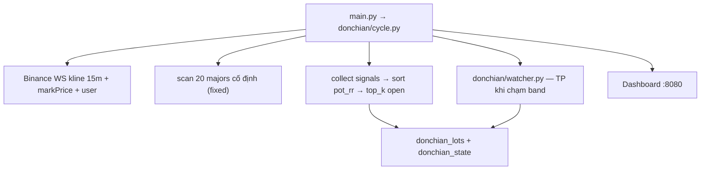
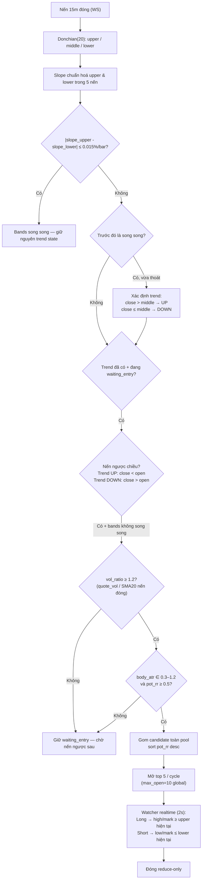
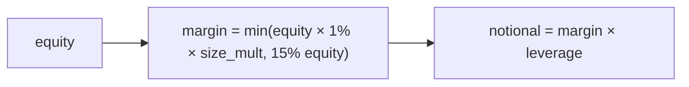

# Bot Donchian Parallel-Trend (USDT-M)

Bot chạy vòng **15 phút**, chiến lược **Donchian parallel-trend + volume** trên nến **15m**: khi 2 band trên/dưới của Donchian Channel **chuyển từ song song sang không song song**, xác định xu hướng theo vị trí close so với band giữa; đợi nến ngược chiều → lọc **vol_ratio** (quote volume / SMA20) + body ATR + pot RR → xếp hạng theo `pot_rr`, mở **top 5** mỗi cycle; thoát khi giá chạm band Donchian hiện tại (không SL cứng).

**Entry point:** `python -m src.main` → `src/donchian/cycle.py`

**Backtest tham chiếu (Config A):** [`backtest_channel_vol_dual_1y_3y.md`](backtest_channel_vol_dual_1y_3y.md) · `scripts/backtest_price_vol_channel_run.py`

---

## 0. Multi-exchange

| Env | Ý nghĩa |
|-----|---------|
| `EXCHANGE=binance` | Binance USDT-M (`fapi.binance.com`) |
| `BINANCE_API_KEY` / `BINANCE_SECRET_KEY` | API key Binance Futures |

---

## 1. Kiến trúc


```mermaid
flowchart TB
    main["main.py → donchian/cycle.py"]
    main --> ws["Binance WS kline 15m + markPrice + user"]
    main --> scan["scan 20 majors cố định (fixed)"]
    main --> rank["collect signals → sort pot_rr → top_k open"]
    main --> watcher["donchian/watcher.py — TP khi chạm band"]
    rank --> db["donchian_lots + donchian_state"]
    main --> web["Dashboard :8080"]
    watcher --> db
```

| Module | Vai trò |
|--------|---------|
| `src/donchian/cycle.py` | Vòng 15m: scan pool, detect signal, rank top_k, mở lệnh |
| `src/donchian/signals.py` | Donchian bands, parallel, vol/body/RR filter, `EntrySignal` |
| `src/donchian/trading.py` | Market open/close; margin = min(equity × 1% × size_mult, 15% equity) |
| `src/donchian/watcher.py` | Mark WS mỗi 2s: TP khi chạm band Donchian |
| `src/donchian/store.py` | SQLite `donchian_lots` + `donchian_state` |
| `src/exchange/` | REST + WS, rate limit, cache |
| `src/web/app.py` | Dashboard Donchian |

---

## 2. Logic tín hiệu


```mermaid
flowchart TD
    kline["Nến 15m đóng (WS)"] --> dc["Donchian(20): upper / middle / lower"]
    dc --> slope["Slope chuẩn hoá upper & lower trong 5 nến"]
    slope --> parallel{"|slope_upper - slope_lower| ≤ 0.015%/bar?"}
    parallel -->|Có| wait["Bands song song — giữ nguyên trend state"]
    parallel -->|Không| exit_check{"Trước đó là song song?"}
    exit_check -->|Có, vừa thoát| trend["Xác định trend:\nclose > middle → UP\nclose ≤ middle → DOWN"]
    exit_check -->|Không| entry_check
    trend --> entry_check{"Trend đã có + đang waiting_entry?"}
    entry_check -->|Có| counter{"Nến ngược chiều?\nTrend UP: close < open\nTrend DOWN: close > open"}
    counter -->|Có + bands không song song| vol{"vol_ratio ≥ 1.2?\n(quote_vol / SMA20 nến đóng)"}
    vol -->|Không| keepWait
    vol -->|Có| filt{"body_atr ∈ 0.3–1.2\nvà pot_rr ≥ 0.5?"}
    filt -->|Không| keepWait["Giữ waiting_entry — chờ nến ngược sau"]
    filt -->|Có| rank["Gom candidate toàn pool\nsort pot_rr desc"]
    rank --> topk["Mở top 5 / cycle\n(max_open=10 global)"]
    topk --> tp["Watcher realtime (2s):\nLong → high/mark ≥ upper hiện tại\nShort → low/mark ≤ lower hiện tại"]
    tp --> close["Đóng reduce-only"]
```

**Quy tắc vào lệnh:**

1. Donchian period **20** · slope lookback **5** · parallel tol **0.015 %/bar**.
2. Trend tại nến **đầu tiên** bands thoát song song (`close > middle` → UP, else DOWN) → `waiting_entry=True`.
3. Chờ **nến ngược chiều** trong khi bands vẫn **không** song song:
   - UP → nến đỏ (`close < open`) → LONG
   - DOWN → nến xanh (`close > open`) → SHORT
4. **Lọc volume (counter candle):**
   - `vol_ratio = quote_volume_nến_đóng / SMA(20)` (mặc định period **20**)
   - **`DONCHIAN_MIN_VOL_RATIO=1.2`** — volume nến counter ≥ 120% TB 20 nến
   - Nếu thiếu `quote_volume`: fallback `volume × close`
   - Fail → **giữ** `waiting_entry`
5. **Lọc chất lượng (body_size_rr05):**
   - `body_atr = |close − open| / ATR(14)` ∈ **[0.3, 1.2]**
   - `pot_rr = dist(entry, TP band) / dist(entry, opposite band)` ≥ **0.5**
   - Fail → **giữ** `waiting_entry`
6. Pass → `size_mult = min(pot_rr, 2.0)` (Config A backtest).
7. **Mỗi cycle 15m:** gom tất cả candidate trong pool → sort `pot_rr` giảm dần → mở tối đa **`DONCHIAN_TOP_K=5`**, dừng khi **`DONCHIAN_MAX_OPEN=10`**.
8. Mở market → watcher TP theo band live.

**Đóng lệnh:** không SL cứng. Watcher TP theo **band Donchian live** (long ≥ upper hiện tại, short ≤ lower hiện tại). `tp_band` lúc entry chỉ để hiển thị / fallback.

**State `waiting_entry`:**

- Chỉ clear khi **mở lệnh thành công**, khi symbol đang có lot mở, hoặc `cap_skip` (max open / margin / đã mở) — bỏ tín hiệu, không queue.
- Candidate không vào top_k: **giữ** `waiting_entry=True` (khớp backtest).
- Chỉ retry khi `open_lot` lỗi sàn (`error`).
- Filter fail **không** clear `waiting_entry`.
- Chỉ **1 lot / symbol**.

### Discord khi mở lệnh

Notify giải thích **vì sao vào** + **vì sao size đó**, ví dụ:

```
LINKUSDT LONG mở — trend UP
lý do: thoát song song → UP; nến đỏ ngược chiều; band không song song; vol_ratio=1.35 (≥1.20)
lọc: body_atr=0.72 (ok 0.3–1.2) · pot_rr=0.85 (≥0.5) · vol_ratio=1.35 (≥1.2)
size: size_mult=0.85× · margin_pct=1.00% → margin=8.50 USDT (equity≈1000)
entry=...
target band=... · opp band=...
size=...
```

---

## 3. Sizing và phí


```mermaid
flowchart LR
    eq[equity] --> m["margin = min(equity × 1% × size_mult, 15% equity)"]
    m --> n["notional = margin × leverage"]
```

| | Giá trị |
|---|---------|
| Base margin | **1% equity** (`DONCHIAN_MARGIN_PCT=0.01`) |
| Margin cap | **15% equity** / lệnh (`DONCHIAN_MARGIN_CAP_PCT=0.15`) |
| Size scale | `size_mult = min(pot_rr, 2.0)` khi `DONCHIAN_SIZE_BY_RR=true` |
| Leverage | `10x` |
| Max lệnh mở | **10** (`DONCHIAN_MAX_OPEN`) |
| Top-K / cycle | **5** (`DONCHIAN_TOP_K`) |
| Phí taker Binance | `0.04%/chiều` |

Ví dụ equity 1000 USDT, `pot_rr=0.85` → `size_mult=0.85`: margin = min(8.50, 150) = **8.50 USDT**, notional = 85 USDT.

### Tương thích lệnh đang chạy (deploy)

**Giữ nguyên — không đóng, không resize lot đang mở.**

| Việc | Hành vi |
|------|---------|
| Lot `status=open` | Watcher vẫn TP theo band Donchian live |
| Size / margin lot cũ | Giữ lúc mở; không chỉnh |
| Filter / top_k / max_open | Chỉ khi **mở lệnh mới** |
| Symbol đang có lot mở | `allow_entry=False` → không mở thêm |

---

## 4. Symbol scan pool

**Mặc định (khớp backtest Config A):** `DONCHIAN_SCAN_MODE=fixed` — **20 majors cố định**:

BTC, ETH, BNB, SOL, XRP, TRX, ADA, AVAX, DOT, LINK, LTC, BCH, XLM, ATOM, NEAR, APT, SUI, ARB, OP, UNI.

- Override: `DONCHIAN_FIXED_SYMBOLS=BTCUSDT,...`
- **Không** áp symbol filter (listing/range) trên pool fixed — khớp backtest.
- Boot **không** chờ miniTicker volume rank.

**Tùy chọn:** `DONCHIAN_SCAN_MODE=volume` — top-N theo 24h quote volume (`DONCHIAN_TOP_N=30`). Symbol filter bật qua `DONCHIAN_SYMBOL_FILTER=true` (listing ≥365d, range ≤15% cho non-major).

`set_watched_symbols(pool + open lots)` → KlineStream subscribe cả coin đang giữ lệnh.

---

## 5. Boot sequence & rate limit safety

```
main() →
  init_db() + ensure_schema()
  mark_boot_rest_quiet()
  start_binance_ws()
  _wait_binance_ws_ready()
  _start_boot_warmup(fixed 20)
  start_watcher()
  vòng lặp cycle 15m
```

- Warmup REST tuần tự — `boot_optional_rest_slot()` + `REST_BOOT_GAP_SEC`
- Scan candles trong cycle: **WS-only**, không REST
- Critical orders không bị block bởi rate limit

---

## 6. SQLite schema

| Bảng | Việc |
|------|------|
| `donchian_lots` | Lot mở/đóng; `pnl_usdt` net sau phí; meta entry |
| `donchian_state` | Trend state per symbol |
| `equity_snapshots` | Chart equity dashboard |

---

## 7. Backtest tham chiếu — Config A (channel + counter + vol≥1.2)

Cùng logic live: Donchian 20 · parallel exit · counter · body/RR · **vol≥1.2** · **top_k=5** · **max_open=10** · margin 1% (cap 15%) · pool **20 majors** · shared wallet · **không** breadth.

**Doc đầy đủ:** [`backtest_channel_vol_dual_1y_3y.md`](backtest_channel_vol_dual_1y_3y.md) · `scripts/backtest_price_vol_channel_run.py`

| Config A | 365d | ~1095d |
|----------|------|--------|
| PF | **1.47** | **1.46** |
| Win rate | 71.3% | 71.7% |
| MaxDD | 38.7% | 52.3% |
| Lệnh / ngày | 28.5 | 28.7 |
| %/ngày (365d) | +5.95% | —* |

\*Return % 3y compound không dùng kỳ vọng live. So **PF ~1.46**, **WR ~71%**, **MaxDD 39–52%**.

### Live ↔ backtest — khớp / khác

| Hạng mục | Backtest Config A | Live |
|----------|-------------------|------|
| Signal (Donchian, vol, body, RR) | ✓ | ✓ |
| Pool 20 majors fixed | ✓ | ✓ |
| max_open=10, top_k=5 | ✓ | ✓ |
| margin 1% × min(pot_rr, 2), cap 15% | ✓ | ✓ |
| Symbol filter | không | không (fixed mode) |
| Breadth flip | không | không |
| TP timing | chạm band trên nến đóng | watcher mark **2s** (sớm/muộn vài giây) |
| Fill | close nến, không slippage | market + slippage |
| Spot skim 40% | không trong BT trade-only | có (`SPOT_TRANSFER_*`) — ngoài phạm vi BT Config A |

---

## 8. Env vars

```
EXCHANGE=binance
BINANCE_API_KEY=...
BINANCE_SECRET_KEY=...

DONCHIAN_PERIOD=20
DONCHIAN_SLOPE_LB=5
DONCHIAN_PARALLEL_TOL=0.015
DONCHIAN_INTERVAL=15m
DONCHIAN_MARGIN_PCT=0.01
DONCHIAN_MARGIN_CAP_PCT=0.15
DONCHIAN_ATR_PERIOD=14
DONCHIAN_MIN_BODY_ATR=0.3
DONCHIAN_MAX_BODY_ATR=1.2
DONCHIAN_MIN_POT_RR=0.5
DONCHIAN_SIZE_BY_RR=true
DONCHIAN_MIN_VOL_RATIO=1.2
DONCHIAN_VOL_RATIO_PERIOD=20
DONCHIAN_MAX_OPEN=10
DONCHIAN_TOP_K=5
DONCHIAN_SCAN_MODE=fixed
DONCHIAN_SYMBOL_FILTER=false
DONCHIAN_TOP_N=30
LEVERAGE=10
TRADING_ENABLED=true

SPOT_TRANSFER_ENABLED=true
SPOT_TRANSFER_MODE=skim
SPOT_TRANSFER_SKIM=0.4
SPOT_TRANSFER_DAY_CAP_PCT=1.5
SPOT_TRANSFER_DD_PAUSE_PCT=20
SPOT_TRANSFER_EXECUTE_HHMM=0700
```

---

## 9. File map

| File | Việc |
|------|------|
| `src/main.py` | Entry → `donchian.cycle.main()` |
| `src/donchian/cycle.py` | Vòng 15m, scan, rank top_k, boot warmup, spot transfer |
| `src/donchian/signals.py` | Donchian bands, filters, `EntrySignal` |
| `src/donchian/trading.py` | Open/close lot, sizing, Discord why |
| `src/donchian/watcher.py` | Mark WS TP check mỗi 2s |
| `src/donchian/store.py` | SQLite schema + CRUD |
| `src/spot_transfer.py` | Rút skim 07:00 +07, lịch sử, risk warn |
| `src/web/app.py` | Dashboard + API |
| `scripts/backtest_price_vol_channel.py` | Engine backtest Config A |
