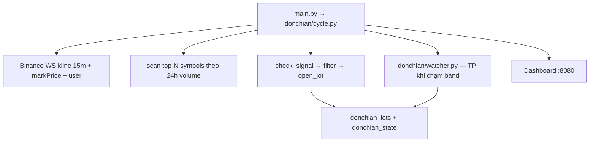
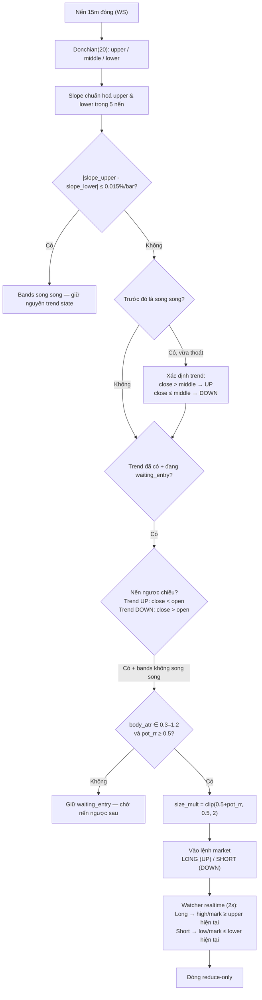
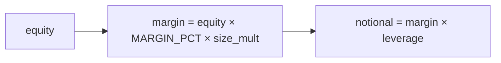

# Bot Donchian Parallel-Trend (USDT-M)

Bot chạy vòng **15 phút**, chiến lược **Donchian parallel-trend** trên nến **15m**: khi 2 band trên/dưới của Donchian Channel **chuyển từ song song sang không song song**, xác định xu hướng theo vị trí close so với band giữa; đợi nến ngược chiều → lọc body ATR + pot RR → vào lệnh với `size_mult`; thoát khi giá chạm band Donchian hiện tại (không SL cứng).

**Entry point:** `python -m src.main` → `src/donchian/cycle.py`

Cấu hình live khớp backtest **body_size_rr05** + **margin 1%** (config `D_margin_1pct`).

---

## 0. Multi-exchange

| Env | Ý nghĩa |
|-----|---------|
| `EXCHANGE=binance` | Binance USDT-M (`fapi.binance.com`) |
| `BINANCE_API_KEY` / `BINANCE_SECRET_KEY` | API key Binance Futures |

---

## 1. Kiến trúc


```mermaid
flowchart TB
    main["main.py → donchian/cycle.py"]
    main --> ws["Binance WS kline 15m + markPrice + user"]
    main --> scan["scan top-N symbols theo 24h volume"]
    main --> entry["check_signal → filter → open_lot"]
    main --> watcher["donchian/watcher.py — TP khi chạm band"]
    entry --> db["donchian_lots + donchian_state"]
    main --> web["Dashboard :8080"]
    watcher --> db
```

| Module | Vai trò |
|--------|---------|
| `src/donchian/cycle.py` | Vòng 15m: scan top-N symbols, detect signal, mở lệnh |
| `src/donchian/signals.py` | Donchian bands, parallel, body/RR filter, `EntrySignal` |
| `src/donchian/trading.py` | Market open/close; margin = equity × 1% × size_mult |
| `src/donchian/watcher.py` | Mark WS mỗi 2s: TP khi chạm band Donchian |
| `src/donchian/store.py` | SQLite `donchian_lots` + `donchian_state` |
| `src/exchange/` | REST + WS, rate limit, cache — giữ nguyên |
| `src/web/app.py` | Dashboard Donchian |

---

## 2. Logic tín hiệu


```mermaid
flowchart TD
    kline["Nến 15m đóng (WS)"] --> dc["Donchian(20): upper / middle / lower"]
    dc --> slope["Slope chuẩn hoá upper & lower trong 5 nến"]
    slope --> parallel{"|slope_upper - slope_lower| ≤ 0.015%/bar?"}
    parallel -->|Có| wait["Bands song song — giữ nguyên trend state"]
    parallel -->|Không| exit_check{"Trước đó là song song?"}
    exit_check -->|Có, vừa thoát| trend["Xác định trend:\nclose > middle → UP\nclose ≤ middle → DOWN"]
    exit_check -->|Không| entry_check
    trend --> entry_check{"Trend đã có + đang waiting_entry?"}
    entry_check -->|Có| counter{"Nến ngược chiều?\nTrend UP: close < open\nTrend DOWN: close > open"}
    counter -->|Có + bands không song song| filt{"body_atr ∈ 0.3–1.2\nvà pot_rr ≥ 0.5?"}
    filt -->|Không| keepWait["Giữ waiting_entry — chờ nến ngược sau"]
    filt -->|Có| size["size_mult = clip(0.5+pot_rr, 0.5, 2)"]
    size --> open["Vào lệnh market\nLONG (UP) / SHORT (DOWN)"]
    open --> tp["Watcher realtime (2s):\nLong → high/mark ≥ upper hiện tại\nShort → low/mark ≤ lower hiện tại"]
    tp --> close["Đóng reduce-only"]
```

**Quy tắc vào lệnh:**

1. Donchian period **20** · slope lookback **5** · parallel tol **0.015 %/bar**.
2. Trend tại nến **đầu tiên** bands thoát song song (`close > middle` → UP, else DOWN) → `waiting_entry=True`.
3. Chờ **nến ngược chiều** trong khi bands vẫn **không** song song:
   - UP → nến đỏ (`close < open`) → LONG
   - DOWN → nến xanh (`close > open`) → SHORT
4. **Lọc chất lượng (body_size_rr05)** trước khi mở:
   - `body_atr = |close − open| / ATR(14)` ∈ **[0.3, 1.2]**
   - `pot_rr = dist(entry, TP band) / dist(entry, opposite band)` ≥ **0.5**
   - Fail → **không vào**, **giữ** `waiting_entry=True` (chờ counter sau)
5. Pass → `size_mult = clip(0.5 + pot_rr, 0.5, 2.0)` → mở market.

**Đóng lệnh:** không SL cứng. Watcher TP theo **band Donchian live** (long ≥ upper hiện tại, short ≤ lower hiện tại). `tp_band` lúc entry chỉ để hiển thị / fallback.

**Khác:**

- `waiting_entry` reset khi vào lệnh thành công, khi **symbol đó** đang có lot mở, hoặc `cap_skip` (max open / margin) — bỏ tín hiệu, không queue. Chỉ retry khi `open_lot` lỗi sàn (`error`).
- Filter fail **không** clear `waiting_entry`.
- Chỉ **1 lot / symbol**; `DONCHIAN_MAX_OPEN` global (mặc định 20).
- Khung nến: `DONCHIAN_INTERVAL` (mặc định `15m`) ghi đè `GRANULARITY`.

### Discord khi mở lệnh

Notify giải thích **vì sao vào** + **vì sao size đó**, ví dụ:

```
LINKUSDT LONG mở — trend UP
lý do: thoát song song → UP; nến đỏ ngược chiều; band không song song
lọc: body_atr=0.72 (ok 0.3–1.2) · pot_rr=0.85 (≥0.5)
size: size_mult=1.35× · margin_pct=1.00% → margin=13.50 USDT (equity≈1000)
entry=...
target band=... · opp band=...
size=...
```

---

## 3. Sizing và phí


```mermaid
flowchart LR
    eq[equity] --> m["margin = equity × MARGIN_PCT × size_mult"]
    m --> n["notional = margin × leverage"]
```

| | Giá trị |
|---|---------|
| Base margin | **1% equity** (`DONCHIAN_MARGIN_PCT=0.01`) |
| Size scale | `size_mult` từ pot_rr khi `DONCHIAN_SIZE_BY_RR=true` |
| Margin thực tế | `equity × 0.01 × size_mult` (clip mult 0.5–2) |
| Leverage | `10x` |
| Max lệnh mở | `20` (`DONCHIAN_MAX_OPEN`) |
| Phí taker Binance | `0.04%/chiều` |

Ví dụ equity 1000 USDT, `size_mult=1.35`: margin = 13.50 USDT, notional = 135 USDT.

### Tương thích lệnh đang chạy (deploy)

**Giữ nguyên — không đóng, không resize, không áp filter mới lên lot đang mở.**

| Việc | Hành vi |
|------|---------|
| Lot `status=open` trong DB / trên sàn | Watcher vẫn TP theo band Donchian live |
| Size / margin lot cũ | Giữ lúc mở (vd. 0.5% cũ); **không** chỉnh lên 1% hay `size_mult` |
| Filter body / pot_rr | Chỉ khi **mở lệnh mới** |
| Cột DB mới (`body_atr`, `pot_rr`, `size_mult`, `opp_band`) | Lot cũ = `NULL`; close notify bỏ qua dòng meta nếu thiếu |
| Symbol đang có lot mở | `allow_entry=False` → không mở thêm |
| Sau khi lot cũ TP | Lệnh tiếp theo dùng rule mới + margin 1% + notify đầy đủ |

Restart bot sau deploy: reconcile lot mở như cũ; **không** force-flat. Production: set `DONCHIAN_MARGIN_PCT=0.01` trong `.env` rồi restart nếu file cũ còn `0.005`.

---

## 4. Symbol scan động

Thay vì hardcode, bot scan **tất cả USDT-M futures** theo 24h quote volume từ WS cache (`!miniTicker@arr`):

- `DONCHIAN_TOP_N = 30` coin volume cao nhất (sau khi lọc)
- Loại trừ: stablecoin (USDC, BUSD, FDUSD…), leverage token (UP/DOWN/BULL/BEAR)
- **Symbol filter** (`DONCHIAN_SYMBOL_FILTER=true`):
  - Listing **≥ 365 ngày** (`DONCHIAN_MIN_LISTING_DAYS`) theo `onboardDate` Binance — **áp dụng mọi coin**
  - **24h range ≤ 15%** (`DONCHIAN_MAX_RANGE_24H_PCT`) — **chỉ non-major**. Majors bypass range (vẫn cần listing ≥ 365d): BTC, ETH, BNB, SOL, XRP, TRX + L1/L2/infra ổn định (ADA, AVAX, DOT, LINK, LTC, BCH, XLM, ATOM, NEAR, APT, SUI, ARB, OP, UNI, AAVE, FIL). **Không** gồm meme (DOGE, PEPE) hay HYPE.
  - **Lệnh đang mở không bị đóng**; coin bị lọc chỉ không mở thêm, watcher vẫn TP
- `set_watched_symbols(top_30 + open lots)` → KlineStream subscribe cả coin đang giữ lệnh
- Không tốn REST để scan — dùng `CACHE.quote_volumes` + `exchangeInfo` cache

---

## 5. Boot sequence & rate limit safety

```
main() →
  init_db() + ensure_schema()
  mark_boot_rest_quiet()          ← chặn optional REST trong REST_BOOT_QUIET_SEC
  start_binance_ws()              ← AllMarket + Kline(top-30) + User stream
  _wait_binance_ws_ready()        ← block 30s chờ kline WS connected
  _start_boot_warmup(top_30)     ← daemon thread, tuần tự từng symbol
                                    boot_optional_rest_slot: gap REST_BOOT_GAP_SEC
                                    chỉ REST khi WS cache < warmup (period+slope+ATR+5)
  start_watcher()                 ← donchian watcher mỗi 2s
  vòng lặp cycle 15m
```

**Rate limit protection (giữ nguyên từ bot cũ):**
- Warmup REST tuần tự — `boot_optional_rest_slot()` serialize 1 request/lần + `REST_BOOT_GAP_SEC` gap
- Trạng thái ban/grace persist vào disk, tự load khi restart
- Scan candles trong cycle: **WS-only**, không REST
- Critical orders (đặt/đóng lệnh) không bị block bởi rate limit

---

## 6. SQLite schema

| Bảng | Việc |
|------|------|
| `donchian_lots` | Lot mở/đóng; `pnl_usdt` net sau phí; meta entry (nullable) |
| `donchian_state` | Trend state per symbol (trend, trend_ts, waiting_entry) |
| `equity_snapshots` | Chart equity dashboard |

Cột meta entry (migrate nullable): `body_atr`, `pot_rr`, `size_mult`, `opp_band`.

---

## 7. Kết quả backtest tham chiếu (body_size_rr05 + margin 1%)

Số liệu **paper** (15m / ~365 ngày, fee 0.04%/side, 10x) — live có thể lệch (slippage, pool top-N động ≠ list cố định).

### 7.1 Gần live nhất: **20 majors**, shared wallet (`D20_like_bot`)

Cùng rule live: body ATR ∈ [0.3, 1.2], pot_rr ≥ 0.5, `size_mult = clip(0.5+pot_rr, 0.5, 2)`, margin **1% × size_mult**, **max_open 20**.

Pool: BTC, ETH, BNB, SOL, XRP, TRX, ADA, AVAX, DOT, LINK, LTC, BCH, XLM, ATOM, NEAR, APT, SUI, ARB, OP, UNI.

| Chỉ số | Paper `D20_like_bot` |
|--------|----------------------|
| %/ngày (TB trên vốn đầu) | ~**+33.5%** |
| Net / 1000$ | ~**+122k** |
| Profit factor | ~**1.48** |
| Wipe | ~**0.68** |
| Win rate | ~**73%** |
| Lệnh / ngày | ~**46** |
| MaxDD (peak→trough equity) | ~**50%** |
| Margin khóa / equity | TB ~**16%**, max ~**36%** (avg ~11 lot mở) |

So sánh cùng pool / cùng filter:

| Config | %/ngày | MaxDD | lệnh/ngày | Note |
|--------|--------|-------|-----------|------|
| **D20_like_bot** (1%, max20) | +33.5% | 49.9% | 46.3 | Giống tham số bot hiện tại |
| D20_max10 (1%, max10) | +10.2% | 35.7% | 34.8 | Bớt slot → DD thấp hơn |
| A20_half (0.5%, max20) | +2.9% | 25.1% | 46.3 | Nhẹ rủi ro hơn |

**Cách đọc:** %/ngày paper D20 **phóng đại** (nhiều lệnh song song trên equity tăng); đáng chú ý hơn là **MaxDD ~50%** và PF/WR vẫn ổn. Live top-N theo volume ≠ đúng 20 major cố định.

Chi tiết: [`backtest_MULTI_donchian_20major_shared_D_15m_365d.md`](backtest_MULTI_donchian_20major_shared_D_15m_365d.md) · script `scripts/backtest_donchian_20coin_shared_d.py`

### 7.2 Ref rủi ro thấp hơn: **5 coin** shared (`D_margin_1pct` / `D5_ref`)

LINK, HYPE, SUI, DOGE, SOL (không BTW), margin 1%, max_open 10:

| Chỉ số | Giá trị (paper) |
|--------|-----------------|
| %/ngày | ~**+1.06%** |
| Profit factor | ~**1.54** |
| Wipe | ~**0.65** |
| Win rate | ~**74%** |
| Lệnh / ngày | ~**11–12** |
| MaxDD | ~**7.6%** |

### 7.3 Docs / script liên quan

- [`backtest_MULTI_donchian_20major_shared_D_15m_365d.md`](backtest_MULTI_donchian_20major_shared_D_15m_365d.md) — **20 majors vs 5-coin** (config gần live)
- [`backtest_MULTI_hunt_pct_per_day_shared_15m_365d.md`](backtest_MULTI_hunt_pct_per_day_shared_15m_365d.md) — hunt %/ngày, config **`D_margin_1pct`** (5 coin)
- [`backtest_MULTI_body_size_rr05_pnl_quality_15m_365d.md`](backtest_MULTI_body_size_rr05_pnl_quality_15m_365d.md) — chất lượng PnL / wipe theo coin (margin 0.5% tách sổ; cùng filter)

Baseline cũ (margin 0.5%, không filter body/RR): `scripts/backtest_link_donchian_parallel_trend.py` — không còn cấu hình live mặc định.

---

## 8. Env vars

```
EXCHANGE=binance
BINANCE_API_KEY=...
BINANCE_SECRET_KEY=...

DONCHIAN_PERIOD=20
DONCHIAN_SLOPE_LB=5
DONCHIAN_PARALLEL_TOL=0.015
DONCHIAN_INTERVAL=15m
DONCHIAN_MARGIN_PCT=0.01
DONCHIAN_ATR_PERIOD=14
DONCHIAN_MIN_BODY_ATR=0.3
DONCHIAN_MAX_BODY_ATR=1.2
DONCHIAN_MIN_POT_RR=0.5
DONCHIAN_SIZE_BY_RR=true
DONCHIAN_MAX_OPEN=20
DONCHIAN_TOP_N=30
LEVERAGE=10
TRADING_ENABLED=true
```

---

## 9. File map

| File | Việc |
|------|------|
| `src/main.py` | Entry → `donchian.cycle.main()` |
| `src/donchian/cycle.py` | Vòng lặp 15m, scan symbols, boot warmup |
| `src/donchian/signals.py` | Donchian bands, filters, `EntrySignal` |
| `src/donchian/trading.py` | Open/close lot, sizing × size_mult, Discord why |
| `src/donchian/watcher.py` | Mark WS TP check mỗi 2s |
| `src/donchian/store.py` | SQLite schema + CRUD |
| `src/web/app.py` | Dashboard + API |
